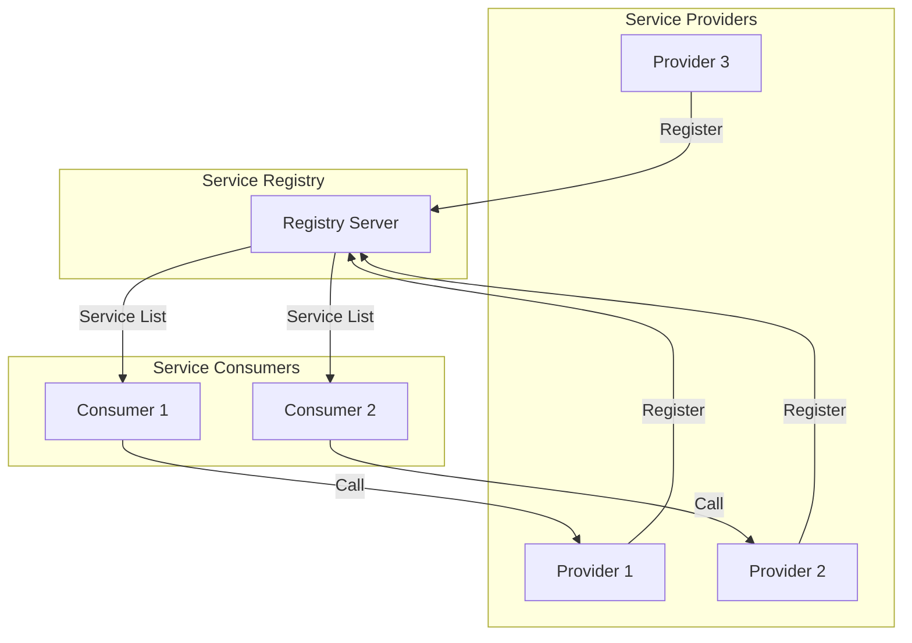

Service discovery is a critical component in microservices architecture, enabling services to find and communicate with each other dynamically without hard-coded addresses.

## Core Concepts

### Service Registry Architecture

A service registry maintains a catalog of available services and their instances:



**Key Information Stored**:
- IP addresses and ports
- Service names and versions
- Health status
- Metadata (region, tags, capabilities)

## Implementation Comparison

<Tabs>
  <Tab title="Eureka">
    ### Spring Cloud Eureka
    
    **Origin**: Netflix (now maintained by Spring)
    
    **CAP Model**: AP (Availability + Partition Tolerance)
    
    **Architecture**: Client-Server with peer-to-peer replication
    
    #### Server Capabilities
    
    <CardGroup cols={2}>
      <Card title="Service Registration" icon="pen-to-square">
        Stores service metadata in a unified registry. Clients register on startup.
      </Card>
      
      <Card title="Registry Table" icon="table">
        Provides service lists to clients. Clients cache locally and refresh every 30 seconds.
      </Card>
      
      <Card title="Service Eviction" icon="trash">
        Removes instances that haven't sent heartbeats for 90 seconds (if not in self-preservation).
      </Card>
      
      <Card title="Self-Preservation" icon="shield-halved">
        Protects registry during network instability. Doesn't remove instances if 85% fail heartbeats within 15 minutes.
      </Card>
    </CardGroup>
    
    #### Client Operations
    
    | Operation | Interval | Description |
    |-----------|----------|-------------|
    | **Register** | On startup | Sends service info (IP, port, metadata) |
    | **Renew (Heartbeat)** | Every 30s | HTTP request to confirm health |
    | **Fetch Registry** | Every 30s | Updates local service cache |
    | **Cancel** | On shutdown | Gracefully deregisters service |
    
    #### Workflow
    
    <Steps>
      <Step title="Server startup">
        Eureka Server starts and waits for registrations
      </Step>
      
      <Step title="Provider registration">
        Service provider registers with server on startup
      </Step>
      
      <Step title="Heartbeat mechanism">
        Provider sends heartbeat every 30 seconds via HTTP
      </Step>
      
      <Step title="Health monitoring">
        Server checks if heartbeat missing for 90s:
        - If less than 85% healthy in 15min → Self-preservation mode
        - If 85% or more healthy → Evict unhealthy instance
      </Step>
      
      <Step title="Consumer discovery">
        Consumer fetches and caches service list, refreshes every 30s
      </Step>
      
      <Step title="Remote invocation">
        Consumer calls provider using cached info (default: round-robin via Ribbon)
      </Step>
      
      <Step title="Graceful shutdown">
        Provider sends deregister request on shutdown
      </Step>
    </Steps>
    
    #### High Availability Cluster
    
    <Info>
      **Cluster Architecture**: Peer-to-peer replication
      
      - No master/slave distinction
      - All nodes are equal
      - **Asynchronous** data replication
      - Eventually consistent (AP model)
    </Info>
    
    **Resilience**: If one node fails:
    - Clients continue working with cached service lists
    - Other nodes handle incoming requests
    - Failed node replicates latest data on recovery
    
    <Warning>
      **Eureka 2.x Status**: The 2.x branch is no longer maintained, but 1.x is actively supported. Spring Cloud uses 1.x and can easily switch to alternatives (ZooKeeper, Consul, Nacos).
    </Warning>
  </Tab>
  
  <Tab title="ZooKeeper">
    ### Apache ZooKeeper
    
    **Origin**: Apache Hadoop ecosystem
    
    **CAP Model**: CP (Consistency + Partition Tolerance)
    
    **Architecture**: Leader-follower with tree-based storage
    
    #### Core Principles
    
    <Card title="Tree Structure" icon="folder-tree">
      ZooKeeper uses a Linux-like hierarchical file system:
      - Each service is a **znode** (unique node)
      - Stores IP, port, service name
      - Supports ephemeral and persistent nodes
    </Card>
    
    #### Workflow
    
    <Steps>
      <Step title="Provider registration">
        Service creates a unique znode with connection details
      </Step>
      
      <Step title="Socket connection">
        ZooKeeper establishes long-lived socket connection with each provider
      </Step>
      
      <Step title="Health monitoring">
        Sends periodic packets; if no response, evicts provider and **pushes** updates to all consumers
      </Step>
      
      <Step title="Consumer discovery">
        Consumer fetches service list on startup and caches locally
      </Step>
      
      <Step title="Remote invocation">
        Uses cached list; fetches fresh list if cache miss
      </Step>
      
      <Step title="Push notifications">
        ZooKeeper actively notifies consumers when services go up/down
      </Step>
    </Steps>
    
    #### Key Differences from Eureka
    
    <CardGroup cols={2}>
      <Card title="CAP Trade-off" icon="balance-scale">
        **ZooKeeper**: CP (Consistency first)
        - Leader election takes 30-120s
        - Cluster unavailable during election
        - Guarantees data consistency
        
        **Eureka**: AP (Availability first)
        - No election needed
        - Instant failover
        - Eventual consistency
      </Card>
      
      <Card title="Best Use Cases" icon="bullseye">
        **ZooKeeper**: Distributed coordination
        - Configuration management
        - Leader election
        - Distributed locks
        - Hadoop/HBase clusters
        
        **Eureka**: Service discovery
        - Microservices registration
        - Dynamic service routing
        - Spring Cloud ecosystems
      </Card>
    </CardGroup>
    
    <Info>
      **Microservices Priority**: Availability > Consistency
      
      In microservices, it's better to route to a potentially stale service than to be completely unavailable. This makes Eureka often more suitable than ZooKeeper for service discovery.
    </Info>
  </Tab>
  
  <Tab title="Nacos">
    ### Alibaba Nacos
    
    **Origin**: Alibaba (Released July 2018)
    
    **CAP Model**: **Both AP and CP** (configurable!)
    
    **Capabilities**: Service registry + Configuration center
    
    #### Architecture
    
    Nacos combines the best features of Eureka and ZooKeeper:
    
    <CardGroup cols={2}>
      <Card title="Service Discovery" icon="compass">
        - Supports HTTP/HTTPS registration
        - Compatible with RPC frameworks (Dubbo)
        - Replaces Eureka, ZooKeeper, Consul
        - Built-in UI dashboard
      </Card>
      
      <Card title="Configuration Management" icon="gear">
        - Dynamic configuration updates
        - No restart required
        - Version control
        - Replaces Spring Cloud Config + Bus, Apollo
      </Card>
    </CardGroup>
    
    #### Workflow
    
    <Steps>
      <Step title="Provider registration">
        Service registers with Nacos server on startup
      </Step>
      
      <Step title="Heartbeat">
        Provider sends periodic HTTP heartbeats to prove availability
      </Step>
      
      <Step title="Health check">
        Nacos evicts instances that fail to send heartbeats
      </Step>
      
      <Step title="Consumer subscription">
        Consumers **subscribe** with a Listener (push model - recommended)
        
        Alternative: Pull model (polling - not recommended)
      </Step>
      
      <Step title="Change notification">
        Listener automatically notifies consumer when service list changes
      </Step>
      
      <Step title="Remote invocation">
        Consumer uses updated service info to make calls
      </Step>
    </Steps>
    
    #### Load Balancing
    
    Nacos uses **Feign** for client-side load balancing:
    
    <Tabs>
      <Tab title="Strategies">
        - Round Robin (default)
        - Weighted Round Robin
        - IP Hash
        - Least Connections
        - Least Connections with Slow Start
      </Tab>
      
      <Tab title="Implementation">
        ```java
        // Interface + annotation approach
        @FeignClient(name = "service-provider")
        public interface ProviderClient {
            @GetMapping("/api/data")
            String getData();
        }
        ```
        
        Uses JDK dynamic proxy under the hood.
      </Tab>
    </Tabs>
    
    #### High Availability Cluster
    
    <Warning>
      **Cluster Requirements**:
      - Minimum: 3 nodes recommended
      - Storage: **MySQL** (Derby only for standalone)
      - Shared database for configuration sync
    </Warning>
    
    #### Scalability Advantage
    
    <Card title="Performance at Scale" icon="rocket">
      **Nacos** can handle **100,000+ service instances** without performance degradation.
      
      **Why?**
      - Efficient health check mechanisms
      - Optimized data structures
      - Better than Eureka's full replication model
      - Better than ZooKeeper's frequent notifications
    </Card>
  </Tab>
</Tabs>

## Decision Matrix

<AccordionGroup>
  <Accordion title="When to Choose Eureka">
    ✅ **Best for:**
    - Spring Cloud microservices
    - Small to medium service counts (less than 10,000 instances)
    - Need for high availability
    - Simple setup requirements
    
    ❌ **Avoid when:**
    - Need strong consistency guarantees
    - Massive scale (>10,000 instances)
    - Require configuration management
  </Accordion>
  
  <Accordion title="When to Choose ZooKeeper">
    ✅ **Best for:**
    - Distributed coordination (leader election, locks)
    - Configuration management
    - Hadoop/HBase ecosystems
    - Strong consistency requirements
    
    ❌ **Avoid when:**
    - Availability is critical
    - Cannot tolerate 30-120s downtime during elections
    - Primary use case is service discovery
  </Accordion>
  
  <Accordion title="When to Choose Nacos">
    ✅ **Best for:**
    - Large-scale deployments (10,000+ instances)
    - Need both service discovery AND config management
    - Want flexible CAP model (switch between AP/CP)
    - Kubernetes environments
    - Dubbo or Spring Cloud ecosystems
    
    ❌ **Avoid when:**
    - Team unfamiliar with Alibaba ecosystem
    - Simple use cases (overhead not justified)
  </Accordion>
  
  <Accordion title="When to Choose Consul">
    ✅ **Best for:**
    - Service Mesh architectures
    - Multi-datacenter deployments
    - Need for built-in health checks
    - HashiCorp ecosystem integration
    
    ❌ **Avoid when:**
    - Using Java exclusively (Go-based, harder debugging)
    - Team lacks Go language expertise
  </Accordion>
</AccordionGroup>

## Comparison Table

| Feature | Eureka | ZooKeeper | Nacos | Consul |
|---------|--------|-----------|-------|--------|
| **CAP Model** | AP | CP | AP & CP | CP |
| **Language** | Java | Java/C | Java | Go |
| **Health Check** | Client heartbeat | Socket keep-alive | HTTP heartbeat | Multiple options |
| **Watch Support** | Long polling | Push | Push/Pull | Long polling |
| **Scale Limit** | ~10K instances | Medium | 100K+ instances | Large |
| **UI Dashboard** | Basic | None | Rich | Rich |
| **Spring Cloud** | Native | Supported | Supported | Supported |
| **Config Center** | No | No | **Yes** | Yes |
| **K8s Integration** | Limited | Limited | **Excellent** | Excellent |
| **Operational Complexity** | Low | Medium | Medium | Medium-High |

## Implementation Example

<Tabs>
  <Tab title="Eureka Client">
    ```java
    // Provider registration
    @SpringBootApplication
    @EnableEurekaClient
    public class ProviderApplication {
        public static void main(String[] args) {
            SpringApplication.run(ProviderApplication.class, args);
        }
    }
    ```
    
    ```yaml
    # application.yml
    eureka:
      client:
        service-url:
          defaultZone: http://localhost:8761/eureka/
      instance:
        lease-renewal-interval-in-seconds: 30
        lease-expiration-duration-in-seconds: 90
    ```
  </Tab>
  
  <Tab title="Nacos Client">
    ```java
    // Provider registration
    @SpringBootApplication
    @EnableDiscoveryClient
    public class ProviderApplication {
        public static void main(String[] args) {
            SpringApplication.run(ProviderApplication.class, args);
        }
    }
    ```
    
    ```yaml
    # application.yml
    spring:
      cloud:
        nacos:
          discovery:
            server-addr: localhost:8848
            namespace: dev
            group: DEFAULT_GROUP
    ```
  </Tab>
</Tabs>

## Design Considerations

<CardGroup cols={2}>
  <Card title="Client-Side Caching" icon="database">
    **Why it matters:**
    - Reduces registry load
    - Improves performance
    - Provides fallback during registry outage
    
    **Best practices:**
    - Cache service lists locally
    - Refresh periodically (30s typical)
    - Handle cache invalidation properly
  </Card>
  
  <Card title="Network Partitions" icon="network-wired">
    **Scenarios to handle:**
    - Registry server unreachable
    - Service instance unreachable
    - Split-brain in clustered registries
    
    **Strategies:**
    - Client-side circuit breakers
    - Retry with exponential backoff
    - Use health checks actively
  </Card>
  
  <Card title="Multi-Datacenter" icon="globe">
    **Considerations:**
    - Cross-region latency
    - Data consistency across DCs
    - Failover strategies
    
    **Patterns:**
    - Region-aware load balancing
    - Prefer local services
    - Registry per datacenter
  </Card>
  
  <Card title="Security" icon="lock">
    **Protect your registry:**
    - Enable authentication/authorization
    - Use TLS for communication
    - Implement rate limiting
    - Network segmentation
    
    **Nacos**: Built-in auth
    **Eureka**: Add Spring Security
  </Card>
</CardGroup>

## Related Topics

<CardGroup cols={2}>
  <Card title="Load Balancing" href="/topics/system-design/load-balancing" icon="scale-balanced">
    Learn how to distribute traffic across discovered services
  </Card>
  
  <Card title="Distributed Systems" href="/topics/distributed-systems/overview" icon="diagram-project">
    Understand broader distributed systems concepts
  </Card>
</CardGroup>
