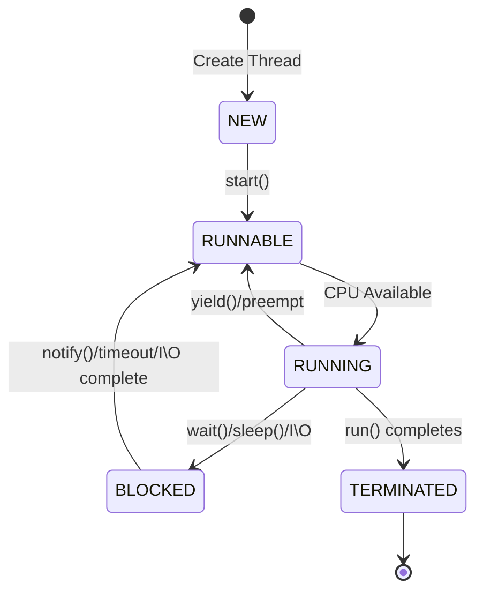

# Java Multithreading & Concurrency

Multithreading is a powerful feature in Java that allows concurrent execution of multiple parts of a program for maximum CPU utilization.

## Understanding Threads

### What is a Thread?

<Note>
  A thread is a lightweight process, the smallest unit of processing that can be scheduled by an operating system. Java supports multithreading through the `java.lang.Thread` class.
</Note>

**Program vs Process vs Thread:**
- **Program**: Static code (set of instructions)
- **Process**: Running instance of a program with its own memory space
- **Thread**: Lightweight sub-process within a process, shares memory

### Thread Lifecycle



<Tabs>
  <Tab title="Thread States">
    1. **NEW**: Thread created but not started
    2. **RUNNABLE**: Thread ready to run or running
    3. **BLOCKED**: Waiting for monitor lock
    4. **WAITING**: Waiting indefinitely for another thread
    5. **TIMED_WAITING**: Waiting for specified time
    6. **TERMINATED**: Thread completed execution
  </Tab>
  
  <Tab title="State Transitions">
    ```java
    Thread thread = new Thread(() -> {
        System.out.println("Running");
    });
    
    System.out.println(thread.getState()); // NEW
    thread.start();
    System.out.println(thread.getState()); // RUNNABLE
    thread.join();
    System.out.println(thread.getState()); // TERMINATED
    ```
  </Tab>
</Tabs>

## Creating Threads

### Method 1: Extending Thread Class

```java
public class MyThread extends Thread {
    private String threadName;
    
    public MyThread(String name) {
        this.threadName = name;
    }
    
    @Override
    public void run() {
        for (int i = 0; i < 5; i++) {
            System.out.println(threadName + ": " + i);
            try {
                Thread.sleep(1000);
            } catch (InterruptedException e) {
                e.printStackTrace();
            }
        }
    }
}

// Usage
public class ThreadDemo {
    public static void main(String[] args) {
        MyThread thread1 = new MyThread("Thread-1");
        MyThread thread2 = new MyThread("Thread-2");
        
        thread1.start();
        thread2.start();
    }
}
```

### Method 2: Implementing Runnable Interface (Recommended)

<Warning>
  Implementing Runnable is preferred because it allows your class to extend another class and promotes better design.
</Warning>

```java
public class MyRunnable implements Runnable {
    private String taskName;
    
    public MyRunnable(String name) {
        this.taskName = name;
    }
    
    @Override
    public void run() {
        for (int i = 0; i < 5; i++) {
            System.out.println(taskName + ": " + i);
            try {
                Thread.sleep(1000);
            } catch (InterruptedException e) {
                Thread.currentThread().interrupt();
            }
        }
    }
}

// Usage
public class RunnableDemo {
    public static void main(String[] args) {
        Thread thread1 = new Thread(new MyRunnable("Task-1"));
        Thread thread2 = new Thread(new MyRunnable("Task-2"));
        
        thread1.start();
        thread2.start();
    }
}
```

### Method 3: Using Lambda Expressions (Java 8+)

```java
public class LambdaThreadDemo {
    public static void main(String[] args) {
        // Using lambda expression
        Thread thread = new Thread(() -> {
            for (int i = 0; i < 5; i++) {
                System.out.println("Lambda Thread: " + i);
                try {
                    Thread.sleep(1000);
                } catch (InterruptedException e) {
                    e.printStackTrace();
                }
            }
        });
        
        thread.start();
    }
}
```

## Thread Synchronization

### The Problem: Race Conditions

<AccordionGroup>
  <Accordion title="Understanding Race Conditions">
    A race condition occurs when multiple threads access shared data concurrently, leading to unpredictable results.

    ```java
    public class Counter {
        private int count = 0;
        
        // UNSAFE - Race condition
        public void increment() {
            count++;  // Not atomic: read-modify-write
        }
        
        public int getCount() {
            return count;
        }
    }

    // Problem demonstration
    public class RaceConditionDemo {
        public static void main(String[] args) throws InterruptedException {
            Counter counter = new Counter();
            
            Thread t1 = new Thread(() -> {
                for (int i = 0; i < 1000; i++) counter.increment();
            });
            
            Thread t2 = new Thread(() -> {
                for (int i = 0; i < 1000; i++) counter.increment();
            });
            
            t1.start();
            t2.start();
            t1.join();
            t2.join();
            
            System.out.println("Count: " + counter.getCount());
            // Expected: 2000, Actual: Often less due to race condition
        }
    }
    ```
  </Accordion>
</AccordionGroup>

### Solution 1: Synchronized Methods

```java
public class SynchronizedCounter {
    private int count = 0;
    
    // SAFE - synchronized method
    public synchronized void increment() {
        count++;
    }
    
    public synchronized int getCount() {
        return count;
    }
}
```

### Solution 2: Synchronized Blocks

<Info>
  Synchronized blocks provide finer-grained control over synchronization, improving performance by locking only critical sections.
</Info>

```java
public class SynchronizedBlockExample {
    private int count = 0;
    private Object lock = new Object();
    
    public void increment() {
        synchronized (lock) {
            count++;
        }
    }
    
    // Synchronized on this object
    public void decrement() {
        synchronized (this) {
            count--;
        }
    }
}
```

### Solution 3: Locks (java.util.concurrent.locks)

<Tabs>
  <Tab title="ReentrantLock">
    ```java
    import java.util.concurrent.locks.ReentrantLock;

    public class LockExample {
        private int count = 0;
        private ReentrantLock lock = new ReentrantLock();
        
        public void increment() {
            lock.lock();
            try {
                count++;
            } finally {
                lock.unlock();  // Always unlock in finally
            }
        }
        
        public void safeIncrement() {
            if (lock.tryLock()) {  // Non-blocking attempt
                try {
                    count++;
                } finally {
                    lock.unlock();
                }
            } else {
                System.out.println("Could not acquire lock");
            }
        }
    }
    ```
  </Tab>
  
  <Tab title="ReadWriteLock">
    ```java
    import java.util.concurrent.locks.ReadWriteLock;
    import java.util.concurrent.locks.ReentrantReadWriteLock;

    public class ReadWriteLockExample {
        private int count = 0;
        private ReadWriteLock rwLock = new ReentrantReadWriteLock();
        
        public void write(int value) {
            rwLock.writeLock().lock();
            try {
                count = value;
            } finally {
                rwLock.writeLock().unlock();
            }
        }
        
        public int read() {
            rwLock.readLock().lock();
            try {
                return count;
            } finally {
                rwLock.readLock().unlock();
            }
        }
    }
    ```
  </Tab>
</Tabs>

## Thread Communication

### wait(), notify(), and notifyAll()

```java
public class ProducerConsumer {
    private List<Integer> queue = new LinkedList<>();
    private int capacity = 5;
    
    public void produce() throws InterruptedException {
        int value = 0;
        while (true) {
            synchronized (this) {
                while (queue.size() == capacity) {
                    wait();  // Wait if queue is full
                }
                
                System.out.println("Produced: " + value);
                queue.add(value++);
                notify();  // Notify consumer
                Thread.sleep(1000);
            }
        }
    }
    
    public void consume() throws InterruptedException {
        while (true) {
            synchronized (this) {
                while (queue.isEmpty()) {
                    wait();  // Wait if queue is empty
                }
                
                int value = queue.remove(0);
                System.out.println("Consumed: " + value);
                notify();  // Notify producer
                Thread.sleep(1000);
            }
        }
    }
}
```

## Executor Framework

### Thread Pools

<Warning>
  Creating threads is expensive. Use thread pools to reuse threads and improve performance.
</Warning>

<CodeGroup>
```java Fixed Thread Pool
import java.util.concurrent.*;

public class FixedThreadPoolExample {
    public static void main(String[] args) {
        // Create a pool with 3 threads
        ExecutorService executor = Executors.newFixedThreadPool(3);
        
        // Submit tasks
        for (int i = 0; i < 10; i++) {
            final int taskId = i;
            executor.submit(() -> {
                System.out.println("Task " + taskId + 
                    " executed by " + Thread.currentThread().getName());
                try {
                    Thread.sleep(1000);
                } catch (InterruptedException e) {
                    e.printStackTrace();
                }
            });
        }
        
        executor.shutdown();
    }
}
```

```java Cached Thread Pool
// Creates threads as needed, reuses idle threads
ExecutorService executor = Executors.newCachedThreadPool();

for (int i = 0; i < 100; i++) {
    executor.submit(() -> {
        // Task logic
    });
}

executor.shutdown();
```

```java Scheduled Thread Pool
ScheduledExecutorService scheduler = 
    Executors.newScheduledThreadPool(2);

// Schedule task to run after 5 seconds
scheduler.schedule(() -> {
    System.out.println("Task executed after delay");
}, 5, TimeUnit.SECONDS);

// Schedule task to run repeatedly
scheduler.scheduleAtFixedRate(() -> {
    System.out.println("Periodic task");
}, 0, 2, TimeUnit.SECONDS);
```
</CodeGroup>

### Callable and Future

```java
import java.util.concurrent.*;

public class CallableExample {
    public static void main(String[] args) throws Exception {
        ExecutorService executor = Executors.newSingleThreadExecutor();
        
        // Callable returns a result
        Callable<Integer> task = () -> {
            Thread.sleep(2000);
            return 42;
        };
        
        // Submit callable and get Future
        Future<Integer> future = executor.submit(task);
        
        System.out.println("Task submitted");
        
        // Do other work...
        
        // Get result (blocks if not ready)
        Integer result = future.get();
        System.out.println("Result: " + result);
        
        executor.shutdown();
    }
}
```

## Concurrent Collections

<Tabs>
  <Tab title="ConcurrentHashMap">
    ```java
    import java.util.concurrent.ConcurrentHashMap;

    ConcurrentHashMap<String, Integer> map = new ConcurrentHashMap<>();

    // Thread-safe operations
    map.put("key1", 1);
    map.putIfAbsent("key2", 2);
    map.computeIfAbsent("key3", k -> 3);
    
    // Atomic operations
    map.compute("key1", (k, v) -> v == null ? 1 : v + 1);
    ```
  </Tab>
  
  <Tab title="BlockingQueue">
    ```java
    import java.util.concurrent.*;

    // Producer-Consumer pattern
    BlockingQueue<Integer> queue = new ArrayBlockingQueue<>(10);

    // Producer
    new Thread(() -> {
        try {
            for (int i = 0; i < 20; i++) {
                queue.put(i);  // Blocks if full
                System.out.println("Produced: " + i);
            }
        } catch (InterruptedException e) {
            e.printStackTrace();
        }
    }).start();

    // Consumer
    new Thread(() -> {
        try {
            while (true) {
                Integer item = queue.take();  // Blocks if empty
                System.out.println("Consumed: " + item);
            }
        } catch (InterruptedException e) {
            e.printStackTrace();
        }
    }).start();
    ```
  </Tab>
  
  <Tab title="CopyOnWriteArrayList">
    ```java
    import java.util.concurrent.CopyOnWriteArrayList;

    // Thread-safe list optimized for reads
    CopyOnWriteArrayList<String> list = new CopyOnWriteArrayList<>();

    list.add("Item 1");
    list.add("Item 2");

    // Safe iteration even during modification
    for (String item : list) {
        System.out.println(item);
    }
    ```
  </Tab>
</Tabs>

## Atomic Classes

```java
import java.util.concurrent.atomic.*;

public class AtomicExample {
    private AtomicInteger counter = new AtomicInteger(0);
    private AtomicReference<String> atomicRef = new AtomicReference<>("initial");
    
    public void increment() {
        counter.incrementAndGet();  // Atomic increment
    }
    
    public void compareAndSet() {
        atomicRef.compareAndSet("initial", "updated");
    }
    
    public int addAndGet(int delta) {
        return counter.addAndGet(delta);
    }
}
```

## Common Concurrency Patterns

### Producer-Consumer with BlockingQueue

```java
import java.util.concurrent.*;

public class ProducerConsumerPattern {
    private static BlockingQueue<Integer> queue = new LinkedBlockingQueue<>(10);
    
    static class Producer implements Runnable {
        public void run() {
            try {
                for (int i = 0; i < 100; i++) {
                    queue.put(i);
                    System.out.println("Produced: " + i);
                    Thread.sleep(100);
                }
            } catch (InterruptedException e) {
                Thread.currentThread().interrupt();
            }
        }
    }
    
    static class Consumer implements Runnable {
        public void run() {
            try {
                while (true) {
                    Integer item = queue.take();
                    System.out.println("Consumed: " + item);
                    Thread.sleep(200);
                }
            } catch (InterruptedException e) {
                Thread.currentThread().interrupt();
            }
        }
    }
    
    public static void main(String[] args) {
        new Thread(new Producer()).start();
        new Thread(new Consumer()).start();
    }
}
```

### Thread-Safe Singleton

<CodeGroup>
```java Eager Initialization
public class EagerSingleton {
    private static final EagerSingleton INSTANCE = new EagerSingleton();
    
    private EagerSingleton() {}
    
    public static EagerSingleton getInstance() {
        return INSTANCE;
    }
}
```

```java Double-Checked Locking
public class DoubleCheckedSingleton {
    private static volatile DoubleCheckedSingleton instance;
    
    private DoubleCheckedSingleton() {}
    
    public static DoubleCheckedSingleton getInstance() {
        if (instance == null) {
            synchronized (DoubleCheckedSingleton.class) {
                if (instance == null) {
                    instance = new DoubleCheckedSingleton();
                }
            }
        }
        return instance;
    }
}
```

```java Enum Singleton (Best)
public enum EnumSingleton {
    INSTANCE;
    
    public void doSomething() {
        // Implementation
    }
}
```
</CodeGroup>

## Best Practices

<Steps>
  <Step title="Avoid Shared Mutable State">
    - Use immutable objects when possible
    - Minimize shared state between threads
    - Use thread-local variables for thread-specific data
  </Step>
  
  <Step title="Use High-Level Concurrency Utilities">
    - Prefer ExecutorService over manual thread creation
    - Use concurrent collections over synchronized collections
    - Leverage atomic classes for simple operations
  </Step>
  
  <Step title="Handle InterruptedException Properly">
    ```java
    try {
        Thread.sleep(1000);
    } catch (InterruptedException e) {
        // Restore interrupt status
        Thread.currentThread().interrupt();
        // Handle or propagate
    }
    ```
  </Step>
  
  <Step title="Avoid Deadlocks">
    - Always acquire locks in the same order
    - Use timeouts with tryLock()
    - Keep synchronized blocks small
  </Step>
  
  <Step title="Document Thread Safety">
    - Clearly document thread-safety guarantees
    - Use annotations: @ThreadSafe, @NotThreadSafe
  </Step>
</Steps>

## Common Pitfalls

<Warning>
  Avoid these common concurrency mistakes:
</Warning>

<AccordionGroup>
  <Accordion title="Forgetting to Synchronize">
    ```java
    // WRONG: Not thread-safe
    private int count = 0;
    public void increment() {
        count++;  // Race condition!
    }
    
    // CORRECT: Synchronized
    private int count = 0;
    public synchronized void increment() {
        count++;
    }
    ```
  </Accordion>

  <Accordion title="Deadlock">
    ```java
    // WRONG: Potential deadlock
    synchronized (lock1) {
        synchronized (lock2) {
            // Critical section
        }
    }
    // Another thread:
    synchronized (lock2) {
        synchronized (lock1) {  // Deadlock!
            // Critical section
        }
    }
    ```
  </Accordion>

  <Accordion title="Not Using volatile for Flags">
    ```java
    // WRONG: May not work correctly
    private boolean running = true;
    
    // CORRECT: Use volatile
    private volatile boolean running = true;
    ```
  </Accordion>
</AccordionGroup>

## Related Topics

<CardGroup>
  <Card title="Java Fundamentals" icon="code" href="/topics/java/fundamentals">
    Learn Java basics
  </Card>
  <Card title="JVM Internals" icon="microchip" href="/topics/java/jvm">
    Understand JVM architecture
  </Card>
  <Card title="Spring Framework" icon="leaf" href="/topics/spring/spring-framework">
    Enterprise development
  </Card>
</CardGroup>