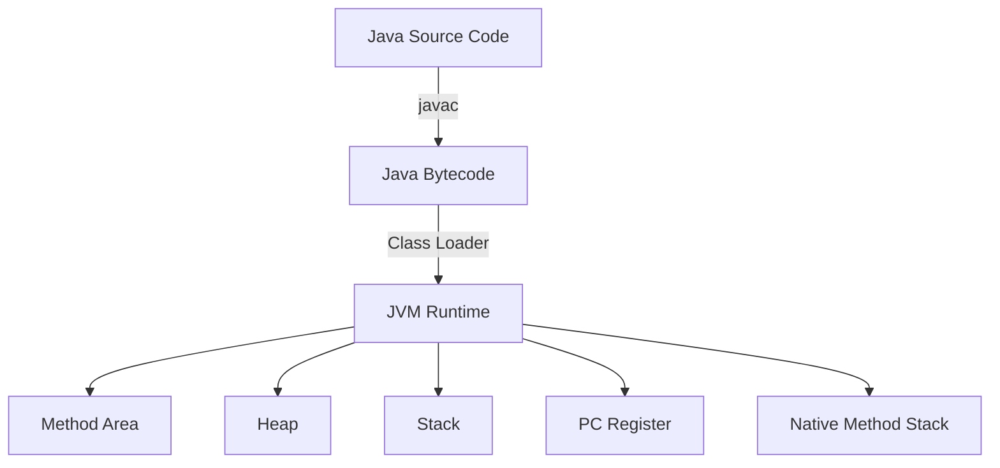

# JVM Internals & Garbage Collection

The Java Virtual Machine (JVM) is the cornerstone of Java's platform independence. Understanding its internals is crucial for writing high-performance Java applications.

## JVM Architecture

### Overview

<Note>
  The JVM is a specification that defines how Java bytecode should be executed. Different vendors provide their own implementations (HotSpot, OpenJ9, GraalVM, etc.).
</Note>



### JVM Components

<AccordionGroup>
  <Accordion title="Class Loader Subsystem">
    Responsible for loading class files into the JVM:
    
    **Three phases:**
    1. **Loading**: Reads .class files and creates binary data
    2. **Linking**: Verification, preparation, and resolution
    3. **Initialization**: Executes static initializers and static blocks

    **Class Loader Hierarchy:**
    ```
    Bootstrap ClassLoader (loads JDK classes)
           ↓
    Extension ClassLoader (loads extension libraries)
           ↓
    Application ClassLoader (loads application classes)
    ```
  </Accordion>

  <Accordion title="Runtime Data Areas">
    Memory areas used during program execution:

    <Tabs>
      <Tab title="Heap">
        - Shared among all threads
        - Stores objects and instance variables
        - Garbage collected
        - Divided into Young and Old generations
      </Tab>
      
      <Tab title="Stack">
        - One per thread
        - Stores method frames
        - Contains local variables and partial results
        - LIFO structure
      </Tab>
      
      <Tab title="Method Area">
        - Shared among all threads
        - Stores class structures (metadata)
        - Runtime constant pool
        - Method code
      </Tab>
      
      <Tab title="PC Register">
        - One per thread
        - Stores address of current instruction
      </Tab>
    </Tabs>
  </Accordion>

  <Accordion title="Execution Engine">
    Executes bytecode through:
    
    - **Interpreter**: Executes bytecode line by line
    - **JIT Compiler**: Compiles frequently used bytecode to native code
    - **Garbage Collector**: Manages memory automatically
  </Accordion>
</AccordionGroup>

## Java Bytecode

### Understanding Bytecode

<Info>
  Java bytecode is the instruction set of the JVM. Understanding bytecode helps in performance optimization and debugging.
</Info>

```java
// Source code
public class HelloWorld {
    public static void main(String[] args) {
        int x = 5;
        int y = 10;
        int sum = x + y;
        System.out.println(sum);
    }
}
```

Corresponding bytecode:
```
Code:
  0: iconst_5       // Push constant 5
  1: istore_1       // Store in local variable 1 (x)
  2: bipush 10      // Push byte constant 10
  4: istore_2       // Store in local variable 2 (y)
  5: iload_1        // Load x
  6: iload_2        // Load y
  7: iadd           // Add x + y
  8: istore_3       // Store result in variable 3 (sum)
  9: getstatic #2   // Get System.out
  12: iload_3       // Load sum
  13: invokevirtual #3  // Call println
  16: return
```

### Common Bytecode Instructions

<Tabs>
  <Tab title="Stack Operations">
    ```
    iconst_<n>  : Push int constant n (-1 to 5)
    iload_<n>   : Load int from local variable n
    istore_<n>  : Store int to local variable n
    dup         : Duplicate top stack value
    pop         : Remove top stack value
    ```
  </Tab>
  
  <Tab title="Arithmetic">
    ```
    iadd    : Add two integers
    isub    : Subtract two integers
    imul    : Multiply two integers
    idiv    : Divide two integers
    irem    : Remainder of division
    ineg    : Negate integer
    ```
  </Tab>
  
  <Tab title="Method Invocation">
    ```
    invokevirtual   : Invoke instance method
    invokestatic    : Invoke static method
    invokespecial   : Invoke constructor/private method
    invokeinterface : Invoke interface method
    invokedynamic   : Invoke dynamic method (Java 7+)
    ```
  </Tab>
</Tabs>

## Memory Management

### Heap Structure

<CodeGroup>
```java Young Generation
// Eden Space + 2 Survivor Spaces (S0, S1)
// New objects are allocated in Eden
// Minor GC moves live objects to survivor spaces

// Example: Object creation
String str = new String("Hello");  // Allocated in Eden
Integer num = 100;  // May be cached (Integer pool)
```

```java Old Generation
// Long-lived objects promoted from Young Gen
// Major GC (Full GC) cleans this area
// More expensive than Minor GC

// Objects that survive multiple GC cycles
// are promoted to Old Generation
```

```java Permanent Generation / Metaspace
// Java 7: Permanent Generation (PermGen)
// Java 8+: Metaspace (native memory)

// Stores:
// - Class metadata
// - Method metadata
// - Constant pool
```
</CodeGroup>

### Memory Configuration

<Warning>
  Proper JVM memory configuration is critical for application performance.
</Warning>

```bash
# Set heap size
java -Xms512m -Xmx2g MyApp
# -Xms: Initial heap size
# -Xmx: Maximum heap size

# Set Young Generation size
java -Xmn256m MyApp

# Set Metaspace size (Java 8+)
java -XX:MetaspaceSize=128m -XX:MaxMetaspaceSize=512m MyApp

# Enable GC logging
java -Xlog:gc*:file=gc.log:time,level,tags MyApp
```

## Garbage Collection

### GC Algorithms

<Tabs>
  <Tab title="Serial GC">
    **Characteristics:**
    - Single-threaded
    - Stop-the-world pauses
    - Suitable for small heaps
    
    ```bash
    java -XX:+UseSerialGC MyApp
    ```
    
    **Use Case:** Single-processor machines or small applications
  </Tab>
  
  <Tab title="Parallel GC">
    **Characteristics:**
    - Multiple threads for GC
    - Higher throughput
    - Longer pause times
    
    ```bash
    java -XX:+UseParallelGC MyApp
    ```
    
    **Use Case:** Batch processing, scientific computing
  </Tab>
  
  <Tab title="CMS (Concurrent Mark Sweep)">
    **Characteristics:**
    - Low pause times
    - Concurrent with application
    - Deprecated in Java 9, removed in Java 14
    
    ```bash
    java -XX:+UseConcMarkSweepGC MyApp
    ```
    
    **Use Case:** Interactive applications (legacy)
  </Tab>
  
  <Tab title="G1 (Garbage First)">
    **Characteristics:**
    - Default in Java 9+
    - Predictable pause times
    - Divides heap into regions
    
    ```bash
    java -XX:+UseG1GC -XX:MaxGCPauseMillis=200 MyApp
    ```
    
    **Use Case:** Large heaps, balanced performance
  </Tab>
  
  <Tab title="ZGC / Shenandoah">
    **ZGC:**
    - Ultra-low latency (less than 10ms pauses)
    - Handles large heaps (TB scale)
    
    ```bash
    java -XX:+UseZGC MyApp
    ```
    
    **Shenandoah:**
    - Concurrent compacting
    - Low pause times
    
    ```bash
    java -XX:+UseShenandoahGC MyApp
    ```
  </Tab>
</Tabs>

### GC Process

<Steps>
  <Step title="Marking Phase">
    Identifies live objects by following references from GC roots:
    - Thread stacks
    - Static variables
    - JNI references
  </Step>
  
  <Step title="Deletion Phase">
    Removes unreferenced objects and reclaims memory
  </Step>
  
  <Step title="Compaction (Optional)">
    Moves live objects together to prevent fragmentation
  </Step>
</Steps>

### Monitoring GC

```java
import java.lang.management.*;

public class GCMonitor {
    public static void main(String[] args) {
        // Get Memory MXBean
        MemoryMXBean memoryBean = ManagementFactory.getMemoryMXBean();
        
        // Heap memory usage
        MemoryUsage heapUsage = memoryBean.getHeapMemoryUsage();
        System.out.println("Heap Memory:");
        System.out.println("  Init: " + heapUsage.getInit() / (1024 * 1024) + " MB");
        System.out.println("  Used: " + heapUsage.getUsed() / (1024 * 1024) + " MB");
        System.out.println("  Max: " + heapUsage.getMax() / (1024 * 1024) + " MB");
        
        // GC information
        for (GarbageCollectorMXBean gc : ManagementFactory.getGarbageCollectorMXBeans()) {
            System.out.println("\nGC: " + gc.getName());
            System.out.println("  Collections: " + gc.getCollectionCount());
            System.out.println("  Time: " + gc.getCollectionTime() + " ms");
        }
    }
}
```

## Performance Tuning

### JIT Compilation

<Note>
  The JIT compiler optimizes frequently executed code ("hot spots") by compiling it to native machine code.
</Note>

```bash
# JIT compiler options
java -XX:+TieredCompilation MyApp  # Default in Java 8+

# Print compilation
java -XX:+PrintCompilation MyApp

# Inline depth
java -XX:MaxInlineLevel=15 MyApp

# Code cache size
java -XX:ReservedCodeCacheSize=256m MyApp
```

### Common Performance Issues

<AccordionGroup>
  <Accordion title="Memory Leaks">
    **Common Causes:**
    - Unclosed resources
    - Static collections
    - Thread locals
    - Event listeners not removed

    **Detection:**
    ```bash
    # Heap dump
    jmap -dump:live,format=b,file=heap.bin <pid>
    
    # Analyze with tools like:
    # - Eclipse MAT
    # - VisualVM
    # - JProfiler
    ```
  </Accordion>

  <Accordion title="High GC Overhead">
    **Symptoms:**
    - Frequent GC cycles
    - Long pause times
    - Low throughput

    **Solutions:**
    - Increase heap size
    - Tune GC algorithm
    - Reduce object creation
    - Use object pools for frequently created objects
  </Accordion>

  <Accordion title="Class Loading Issues">
    **Problems:**
    - ClassNotFoundException
    - NoClassDefFoundError
    - Class version conflicts

    **Debugging:**
    ```bash
    # Verbose class loading
    java -verbose:class MyApp
    
    # Custom class loader debugging
    java -XX:+TraceClassLoading -XX:+TraceClassUnloading MyApp
    ```
  </Accordion>
</AccordionGroup>

### Profiling Tools

<CardGroup cols={2}>
  <Card title="jstat" icon="chart-line">
    Monitor JVM statistics
    ```bash
    jstat -gc <pid> 1000
    ```
  </Card>
  <Card title="jmap" icon="map">
    Memory map and heap dump
    ```bash
    jmap -heap <pid>
    ```
  </Card>
  <Card title="jstack" icon="layer-group">
    Thread dump for deadlock detection
    ```bash
    jstack <pid>
    ```
  </Card>
  <Card title="VisualVM" icon="eye">
    All-in-one profiling tool with GUI
  </Card>
</CardGroup>

## Best Practices

<Steps>
  <Step title="Choose Right GC">
    - G1GC for most applications
    - ZGC/Shenandoah for low-latency requirements
    - Parallel GC for batch processing
  </Step>
  
  <Step title="Monitor and Profile">
    - Enable GC logging in production
    - Use APM tools (New Relic, Dynatrace)
    - Regular heap dump analysis
  </Step>
  
  <Step title="Optimize Memory Usage">
    - Reuse objects when possible
    - Use primitive types over wrappers
    - Close resources properly (try-with-resources)
  </Step>
  
  <Step title="Set Proper Limits">
    - Configure heap size based on workload
    - Set Metaspace limits
    - Configure GC pause time goals
  </Step>
</Steps>

## Related Topics

<CardGroup>
  <Card title="Java Fundamentals" icon="code" href="/topics/java/fundamentals">
    Learn Java basics
  </Card>
  <Card title="Concurrency" icon="gears" href="/topics/java/concurrency">
    Master multithreading
  </Card>
  <Card title="Spring Framework" icon="leaf" href="/topics/spring/spring-framework">
    Enterprise development
  </Card>
</CardGroup>