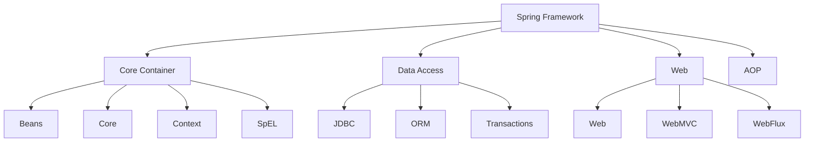

# Spring Framework

Spring Framework is the most popular application development framework for enterprise Java. It provides comprehensive infrastructure support for developing Java applications.

## Framework Overview

### What is Spring?

<Note>
  Spring Framework is an open-source framework that makes Java/J2EE development easier. It provides a lightweight container that manages the lifecycle and configuration of application objects.
</Note>

### Core Modules



<CardGroup cols={2}>
  <Card title="Core Container" icon="box">
    - **Beans**: Bean factory
    - **Core**: IoC and DI
    - **Context**: ApplicationContext
    - **SpEL**: Spring Expression Language
  </Card>
  
  <Card title="Data Access" icon="database">
    - **JDBC**: Database access
    - **ORM**: Hibernate, JPA integration
    - **Transactions**: Transaction management
  </Card>
  
  <Card title="Web" icon="globe">
    - **Web**: Basic web support
    - **WebMVC**: MVC framework
    - **WebFlux**: Reactive web
  </Card>
  
  <Card title="AOP" icon="scissors">
    - **Aspect-Oriented Programming**
    - Cross-cutting concerns
    - Declarative transactions
  </Card>
</CardGroup>

## Inversion of Control (IoC)

### Understanding IoC

<Accordion title="What is IoC?">
  **Inversion of Control** is a principle where the control of object creation and dependency management is inverted from the application code to the framework.
  
  **Traditional Approach:**
  ```java
  public class UserService {
      private UserRepository userRepository = new UserRepository();
      // Tightly coupled
  }
  ```
  
  **IoC Approach:**
  ```java
  public class UserService {
      private UserRepository userRepository;
      
      // Dependency injected by Spring
      public UserService(UserRepository userRepository) {
          this.userRepository = userRepository;
      }
  }
  ```
</Accordion>

### Dependency Injection (DI)

<Tabs>
  <Tab title="Constructor Injection">
    **Recommended approach** - immutable dependencies
    
    ```java
    @Service
    public class UserService {
        private final UserRepository userRepository;
        private final EmailService emailService;
        
        @Autowired  // Optional in Spring 4.3+
        public UserService(UserRepository userRepository, 
                          EmailService emailService) {
            this.userRepository = userRepository;
            this.emailService = emailService;
        }
    }
    ```
  </Tab>
  
  <Tab title="Setter Injection">
    Optional dependencies
    
    ```java
    @Service
    public class UserService {
        private UserRepository userRepository;
        
        @Autowired
        public void setUserRepository(UserRepository userRepository) {
            this.userRepository = userRepository;
        }
    }
    ```
  </Tab>
  
  <Tab title="Field Injection">
    Not recommended - hard to test
    
    ```java
    @Service
    public class UserService {
        @Autowired
        private UserRepository userRepository;
    }
    ```
  </Tab>
</Tabs>

## Spring Beans

### Bean Definition

<CodeGroup>
```java Annotation-Based
@Component
public class UserService {
    // Automatically detected by component scanning
}

@Repository  // Specialized @Component for DAOs
public class UserRepository {}

@Service     // Specialized @Component for services
public class EmailService {}

@Controller  // Specialized @Component for web controllers
public class UserController {}
```

```java Java Configuration
@Configuration
public class AppConfig {
    
    @Bean
    public UserService userService() {
        return new UserService(userRepository());
    }
    
    @Bean
    public UserRepository userRepository() {
        return new UserRepository();
    }
}
```

```xml XML Configuration
<beans>
    <bean id="userService" class="com.example.UserService">
        <constructor-arg ref="userRepository"/>
    </bean>
    
    <bean id="userRepository" class="com.example.UserRepository"/>
</beans>
```
</CodeGroup>

### Bean Scopes

<Tabs>
  <Tab title="Singleton">
    **Default scope** - One instance per Spring container
    
    ```java
    @Component
    @Scope("singleton")  // Default, can be omitted
    public class UserService {}
    ```
  </Tab>
  
  <Tab title="Prototype">
    New instance for each request
    
    ```java
    @Component
    @Scope("prototype")
    public class ShoppingCart {}
    ```
  </Tab>
  
  <Tab title="Request">
    One instance per HTTP request (Web)
    
    ```java
    @Component
    @Scope(value = WebApplicationContext.SCOPE_REQUEST)
    public class LoginForm {}
    ```
  </Tab>
  
  <Tab title="Session">
    One instance per HTTP session (Web)
    
    ```java
    @Component
    @Scope(value = WebApplicationContext.SCOPE_SESSION)
    public class UserPreferences {}
    ```
  </Tab>
</Tabs>

### Bean Lifecycle

```java
@Component
public class LifecycleBean {
    
    // 1. Constructor
    public LifecycleBean() {
        System.out.println("1. Constructor called");
    }
    
    // 2. Dependency Injection
    @Autowired
    public void setDependency(SomeDependency dependency) {
        System.out.println("2. Dependency injected");
    }
    
    // 3. Post-initialization
    @PostConstruct
    public void init() {
        System.out.println("3. @PostConstruct");
    }
    
    // 4. Custom init method
    @Bean(initMethod = "customInit")
    public void customInit() {
        System.out.println("4. Custom init");
    }
    
    // 5. Pre-destruction
    @PreDestroy
    public void cleanup() {
        System.out.println("5. @PreDestroy");
    }
}
```

## Aspect-Oriented Programming (AOP)

### AOP Concepts

<AccordionGroup>
  <Accordion title="What is AOP?">
    AOP allows you to modularize cross-cutting concerns (logging, security, transactions) that would otherwise be scattered across multiple classes.
    
    **Key Concepts:**
    - **Aspect**: Module containing cross-cutting logic
    - **Join Point**: Point in program execution
    - **Advice**: Action taken at join point
    - **Pointcut**: Expression that matches join points
  </Accordion>

  <Accordion title="Types of Advice">
    - **@Before**: Before method execution
    - **@After**: After method execution (finally)
    - **@AfterReturning**: After successful execution
    - **@AfterThrowing**: After exception
    - **@Around**: Before and after execution
  </Accordion>
</AccordionGroup>

### AOP Examples

<CodeGroup>
```java Logging Aspect
@Aspect
@Component
public class LoggingAspect {
    
    @Before("execution(* com.example.service.*.*(..))")
    public void logBefore(JoinPoint joinPoint) {
        System.out.println("Executing: " + 
            joinPoint.getSignature().getName());
    }
    
    @AfterReturning(
        pointcut = "execution(* com.example.service.*.*(..))",
        returning = "result"
    )
    public void logAfterReturning(JoinPoint joinPoint, Object result) {
        System.out.println("Method returned: " + result);
    }
    
    @AfterThrowing(
        pointcut = "execution(* com.example.service.*.*(..))",
        throwing = "error"
    )
    public void logAfterThrowing(JoinPoint joinPoint, Throwable error) {
        System.out.println("Exception: " + error.getMessage());
    }
}
```

```java Performance Monitoring
@Aspect
@Component
public class PerformanceAspect {
    
    @Around("@annotation(com.example.annotation.Timed)")
    public Object measureTime(ProceedingJoinPoint pjp) throws Throwable {
        long start = System.currentTimeMillis();
        
        Object result = pjp.proceed();
        
        long executionTime = System.currentTimeMillis() - start;
        System.out.println(pjp.getSignature() + 
            " executed in " + executionTime + "ms");
        
        return result;
    }
}

// Custom annotation
@Target(ElementType.METHOD)
@Retention(RetentionPolicy.RUNTIME)
public @interface Timed {}

// Usage
@Service
public class UserService {
    @Timed
    public List<User> findAllUsers() {
        // Method implementation
    }
}
```

```java Transaction Management
@Aspect
@Component
public class TransactionAspect {
    
    @Around("@annotation(org.springframework.transaction.annotation.Transactional)")
    public Object manageTransaction(ProceedingJoinPoint pjp) throws Throwable {
        System.out.println("Starting transaction");
        
        try {
            Object result = pjp.proceed();
            System.out.println("Committing transaction");
            return result;
        } catch (Exception e) {
            System.out.println("Rolling back transaction");
            throw e;
        }
    }
}
```
</CodeGroup>

## Spring Configuration

### Application Configuration

<Tabs>
  <Tab title="Java Config">
    ```java
    @Configuration
    @ComponentScan(basePackages = "com.example")
    @EnableTransactionManagement
    @EnableAspectJAutoProxy
    public class AppConfig {
        
        @Bean
        public DataSource dataSource() {
            DriverManagerDataSource dataSource = new DriverManagerDataSource();
            dataSource.setDriverClassName("com.mysql.cj.jdbc.Driver");
            dataSource.setUrl("jdbc:mysql://localhost:3306/mydb");
            dataSource.setUsername("root");
            dataSource.setPassword("password");
            return dataSource;
        }
        
        @Bean
        public JdbcTemplate jdbcTemplate(DataSource dataSource) {
            return new JdbcTemplate(dataSource);
        }
    }
    ```
  </Tab>
  
  <Tab title="Properties">
    ```java
    @Configuration
    @PropertySource("classpath:application.properties")
    public class AppConfig {
        
        @Value("${db.url}")
        private String dbUrl;
        
        @Value("${db.username}")
        private String dbUsername;
        
        @Bean
        public DataSource dataSource() {
            DriverManagerDataSource dataSource = new DriverManagerDataSource();
            dataSource.setUrl(dbUrl);
            dataSource.setUsername(dbUsername);
            return dataSource;
        }
    }
    ```
    
    ```properties
    # application.properties
    db.url=jdbc:mysql://localhost:3306/mydb
    db.username=root
    db.password=secret
    ```
  </Tab>
</Tabs>

### Profiles

```java
@Configuration
@Profile("dev")
public class DevConfig {
    @Bean
    public DataSource devDataSource() {
        // Development database
        return new EmbeddedDatabaseBuilder()
            .setType(EmbeddedDatabaseType.H2)
            .build();
    }
}

@Configuration
@Profile("prod")
public class ProdConfig {
    @Bean
    public DataSource prodDataSource() {
        // Production database
        return new DriverManagerDataSource("jdbc:mysql://prod-server/db");
    }
}
```

Activate profile:
```bash
# Command line
java -Dspring.profiles.active=prod -jar myapp.jar

# application.properties
spring.profiles.active=dev
```

## Data Access

### JDBC Template

```java
@Repository
public class UserRepositoryImpl implements UserRepository {
    
    @Autowired
    private JdbcTemplate jdbcTemplate;
    
    @Override
    public User findById(Long id) {
        String sql = "SELECT * FROM users WHERE id = ?";
        return jdbcTemplate.queryForObject(sql, new Object[]{id}, 
            (rs, rowNum) -> {
                User user = new User();
                user.setId(rs.getLong("id"));
                user.setName(rs.getString("name"));
                user.setEmail(rs.getString("email"));
                return user;
            });
    }
    
    @Override
    public List<User> findAll() {
        String sql = "SELECT * FROM users";
        return jdbcTemplate.query(sql, 
            (rs, rowNum) -> {
                User user = new User();
                user.setId(rs.getLong("id"));
                user.setName(rs.getString("name"));
                return user;
            });
    }
    
    @Override
    public int save(User user) {
        String sql = "INSERT INTO users (name, email) VALUES (?, ?)";
        return jdbcTemplate.update(sql, user.getName(), user.getEmail());
    }
}
```

### Transaction Management

<Warning>
  Always use transactions for operations that modify data to ensure data consistency.
</Warning>

```java
@Service
public class UserService {
    
    @Autowired
    private UserRepository userRepository;
    
    @Transactional
    public void createUser(User user) {
        userRepository.save(user);
        // If exception occurs, transaction will rollback
    }
    
    @Transactional(readOnly = true)
    public User getUser(Long id) {
        return userRepository.findById(id);
    }
    
    @Transactional(
        propagation = Propagation.REQUIRED,
        isolation = Isolation.READ_COMMITTED,
        timeout = 30,
        rollbackFor = Exception.class
    )
    public void complexOperation() {
        // Complex transactional operation
    }
}
```

## Testing

### Unit Testing

```java
@ExtendWith(MockitoExtension.class)
public class UserServiceTest {
    
    @Mock
    private UserRepository userRepository;
    
    @InjectMocks
    private UserService userService;
    
    @Test
    public void testFindUser() {
        User expectedUser = new User(1L, "John");
        when(userRepository.findById(1L)).thenReturn(expectedUser);
        
        User actualUser = userService.findUser(1L);
        
        assertEquals(expectedUser, actualUser);
        verify(userRepository).findById(1L);
    }
}
```

### Integration Testing

```java
@SpringBootTest
@AutoConfigureMockMvc
public class UserControllerIntegrationTest {
    
    @Autowired
    private MockMvc mockMvc;
    
    @Autowired
    private UserRepository userRepository;
    
    @Test
    public void testGetUser() throws Exception {
        User user = new User(1L, "John");
        userRepository.save(user);
        
        mockMvc.perform(get("/users/1"))
            .andExpect(status().isOk())
            .andExpect(jsonPath("$.name").value("John"));
    }
}
```

## Best Practices

<Steps>
  <Step title="Use Constructor Injection">
    - Promotes immutability
    - Makes dependencies explicit
    - Easier to test
  </Step>
  
  <Step title="Favor Composition Over Inheritance">
    - More flexible design
    - Easier to maintain
    - Better testability
  </Step>
  
  <Step title="Keep Beans Stateless">
    - Especially for singleton beans
    - Thread-safe by design
    - Easier to scale
  </Step>
  
  <Step title="Use Appropriate Bean Scopes">
    - Singleton for stateless beans
    - Prototype for stateful beans
    - Request/Session for web-specific data
  </Step>
  
  <Step title="Leverage Spring Boot">
    - Auto-configuration
    - Embedded servers
    - Production-ready features
  </Step>
</Steps>

## Related Topics

<CardGroup>
  <Card title="Spring Boot" icon="rocket" href="/topics/spring/spring-boot">
    Rapid application development
  </Card>
  <Card title="Java Fundamentals" icon="code" href="/topics/java/fundamentals">
    Java basics
  </Card>
  <Card title="JVM Internals" icon="microchip" href="/topics/java/jvm">
    Understanding JVM
  </Card>
</CardGroup>