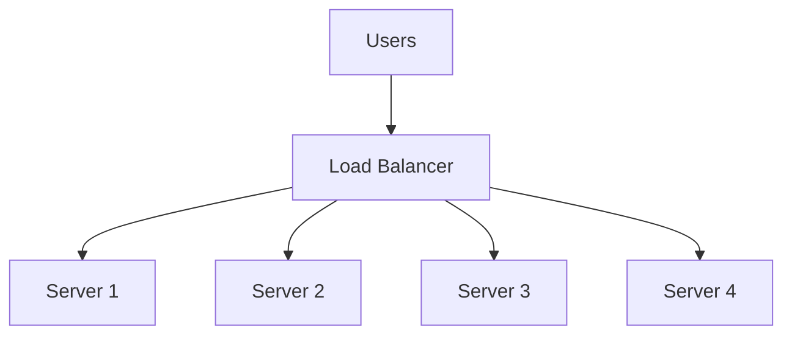

Load balancing is essential for distributing high-concurrency user requests across multiple application servers, enabling horizontal scaling and improved system reliability.

## What is Load Balancing?

Load balancing distributes incoming network traffic across a cluster of servers to:

- **Maximize throughput**: Utilize multiple servers' computing resources
- **Minimize response time**: Route requests to available servers
- **Avoid overload**: Prevent any single server from becoming a bottleneck
- **Ensure high availability**: Continue serving requests even if servers fail



## Load Balancing Approaches

<Tabs>
  <Tab title="HTTP Redirect">
    ### HTTP Redirect Load Balancing
    
    **Mechanism**: Load balancer returns HTTP 302 redirect to selected application server
    
    #### How It Works
    
    <Steps>
      <Step title="Initial request">
        User sends HTTP request to load balancer
      </Step>
      
      <Step title="Server selection">
        Load balancer selects target server using algorithm (random, round-robin, etc.)
      </Step>
      
      <Step title="Redirect response">
        Returns HTTP 302 with application server IP address
      </Step>
      
      <Step title="Direct connection">
        Browser sends new request directly to application server
      </Step>
    </Steps>
    
    ```mermaid
    sequenceDiagram
        participant User
        participant LoadBalancer
        participant AppServer
        
        User->>LoadBalancer: GET /api/data
        LoadBalancer->>User: 302 Redirect to server1.example.com
        User->>AppServer: GET /api/data
        AppServer->>User: 200 OK + Data
    ```
    
    #### Simple Implementation
    
    ```java
    @Override
    protected void doGet(HttpServletRequest request, 
                        HttpServletResponse response) 
                        throws ServletException, IOException {
        // Get client request URL
        String clientRequestURL = request.getRequestURL().toString();
        
        // Select target server based on condition
        String targetURL;
        if (someCondition()) {
            targetURL = "http://server1.example.com" + request.getServletPath();
        } else {
            targetURL = "http://server2.example.com" + request.getServletPath();
        }
        
        // Execute redirect
        response.sendRedirect(targetURL);
    }
    ```
    
    <Card title="Simplicity vs. Practicality" icon="scale-balanced">
      This approach can be implemented in **less than 10 lines of Java code**, making it extremely simple. However, it's rarely used in production due to significant drawbacks.
    </Card>
    
    #### Advantages
    
    <CardGroup cols={2}>
      <Card title="Simple Design" icon="code">
        Easy to implement with minimal code
      </Card>
      
      <Card title="No Proxy Overhead" icon="bolt">
        Load balancer doesn't handle response traffic
      </Card>
    </CardGroup>
    
    #### Disadvantages
    
    <Warning>
      **Critical Issues:**
      
      1. **Double Request Overhead**
         - User makes TWO requests per operation
         - First to load balancer, then to application server
         - Doubles latency and network overhead
      
      2. **Security Vulnerability**
         - Application server IP addresses exposed to public
         - Direct external access to application servers
         - Cannot hide servers behind firewall
         - Increased attack surface
      
      3. **Limited Control**
         - Cannot inspect or modify response traffic
         - No SSL termination at load balancer
         - Difficult to implement sticky sessions
    </Warning>
    
    <Info>
      **Industry Practice**: HTTP redirect load balancing is rarely used in production. Modern systems prefer DNS load balancing combined with internal HTTP load balancers.
    </Info>
  </Tab>
  
  <Tab title="DNS Load Balancing">
    ### DNS Load Balancing
    
    **Mechanism**: DNS server returns different IP addresses to different clients
    
    #### How It Works
    
    <Steps>
      <Step title="Domain name request">
        Browser needs to resolve domain to IP before making HTTP request
      </Step>
      
      <Step title="DNS resolution">
        DNS server applies load balancing algorithm during name resolution
      </Step>
      
      <Step title="IP address returned">
        Different users receive different IP addresses
      </Step>
      
      <Step title="Direct connection">
        User connects directly to assigned server
      </Step>
    </Steps>
    
    ```mermaid
    sequenceDiagram
        participant U1 as User 1
        participant U2 as User 2
        participant DNS
        participant LB1 as Load Balancer 1
        participant LB2 as Load Balancer 2
        
        U1->>DNS: Resolve www.example.com
        DNS->>U1: 192.168.1.10 (LB1)
        
        U2->>DNS: Resolve www.example.com
        DNS->>U2: 192.168.1.20 (LB2)
        
        U1->>LB1: HTTP Request
        U2->>LB2: HTTP Request
    ```
    
    #### Advantages Over HTTP Redirect
    
    <CardGroup cols={2}>
      <Card title="Performance" icon="gauge-high">
        **No repeated DNS lookups**
        - DNS results cached locally
        - Cache duration: minutes to hours
        - No performance impact on subsequent requests
      </Card>
      
      <Card title="Security" icon="shield">
        **Two-tier architecture**
        - DNS resolves to **load balancer** IPs
        - Application servers use **private IPs**
        - No direct external access to app servers
        - Reduced attack surface
      </Card>
    </CardGroup>
    
    #### Two-Tier Load Balancing
    
    <Info>
      **Best Practice**: Large-scale internet applications use **two levels** of load balancing:
      
      1. **DNS Level**: Distributes traffic to load balancer cluster
      2. **Load Balancer Level**: Distributes traffic to application server cluster
    </Info>
    
    ```mermaid
    graph TB
        U[User Requests] --> DNS[DNS Load Balancing]
        DNS --> LB1[LB Server 1]
        DNS --> LB2[LB Server 2]
        DNS --> LB3[LB Server 3]
        
        LB1 --> A1[App Server 1]
        LB1 --> A2[App Server 2]
        LB2 --> A3[App Server 3]
        LB2 --> A4[App Server 4]
        LB3 --> A5[App Server 5]
        LB3 --> A6[App Server 6]
    ```
    
    **Benefits**:
    - Application servers use **internal IPs only**
    - Only load balancers exposed to internet
    - Load balancers have strict firewall rules
    - Defense in depth security model
    
    #### Real-World Usage
    
    <Card title="Industry Adoption" icon="building">
      **Used by major platforms:**
      - Google
      - Baidu
      - Taobao/Alibaba
      - Amazon
      - Most large-scale internet applications
    </Card>
    
    **Test it yourself:**
    ```bash
    # Different computers will get different IPs
    ping www.baidu.com
    
    # Example results:
    # Computer 1: 110.242.68.3
    # Computer 2: 110.242.68.4
    ```
    
    #### Configuration
    
    <Steps>
      <Step title="Choose DNS provider">
        Select domain registrar with load balancing support (most providers offer this)
      </Step>
      
      <Step title="Configure A records">
        Add multiple A records pointing to different load balancer IPs
      </Step>
      
      <Step title="Set TTL">
        Configure Time-To-Live for DNS cache duration
      </Step>
      
      <Step title="Monitor distribution">
        Verify traffic is distributed across all IPs
      </Step>
    </Steps>
    
    <Note>
      **No coding required!** DNS load balancing is configured through your domain provider's control panel, not in application code.
    </Note>
    
    #### Limitations
    
    <Warning>
      **DNS caching challenges:**
      - Cannot instantly redirect traffic during failures
      - TTL creates delay in propagating changes
      - Client-side DNS caching is unpredictable
      - Geographic distribution may not be optimal
    </Warning>
  </Tab>
  
  <Tab title="Reverse Proxy">
    ### Reverse Proxy Load Balancing
    
    **Mechanism**: Load balancer acts as proxy, forwarding requests and responses
    
    #### Common Technologies
    
    <CardGroup cols={3}>
      <Card title="Nginx" icon="server">
        - Most popular
        - High performance
        - Rich features
        - Event-driven
      </Card>
      
      <Card title="HAProxy" icon="network-wired">
        - TCP/HTTP load balancing
        - Advanced health checks
        - Detailed statistics
      </Card>
      
      <Card title="Envoy" icon="diagram-project">
        - Modern architecture
        - Service mesh native
        - Dynamic configuration
      </Card>
    </CardGroup>
    
    #### Nginx Example
    
    ```nginx
    upstream backend {
        # Load balancing strategy
        least_conn;  # or: ip_hash, random, etc.
        
        # Backend servers
        server 192.168.1.10:8080 weight=3;
        server 192.168.1.11:8080 weight=2;
        server 192.168.1.12:8080 weight=1 backup;
        
        # Health check
        server 192.168.1.13:8080 max_fails=3 fail_timeout=30s;
    }
    
    server {
        listen 80;
        server_name example.com;
        
        location / {
            proxy_pass http://backend;
            proxy_set_header Host $host;
            proxy_set_header X-Real-IP $remote_addr;
            proxy_set_header X-Forwarded-For $proxy_add_x_forwarded_for;
        }
    }
    ```
    
    #### Advantages
    
    <CardGroup cols={2}>
      <Card title="Full Control" icon="sliders">
        - Inspect and modify requests/responses
        - SSL/TLS termination
        - Request routing by path/header
        - Response compression
      </Card>
      
      <Card title="Advanced Features" icon="star">
        - Sticky sessions
        - Rate limiting
        - Caching
        - Authentication
      </Card>
    </CardGroup>
  </Tab>
</Tabs>

## Load Balancing Strategies

Algorithms for selecting which server handles each request:

<AccordionGroup>
  <Accordion title="Round Robin" icon="rotate">
    **Pattern**: Distribute requests sequentially in circular order
    
    **How it works**:
    ```
    Request 1 → Server 1
    Request 2 → Server 2
    Request 3 → Server 3
    Request 4 → Server 1 (cycle repeats)
    ```
    
    ✅ **Pros**:
    - Simple to implement
    - Fair distribution
    - No server state required
    
    ❌ **Cons**:
    - Doesn't account for server capacity
    - Ignores current server load
    - May overload slower servers
    
    **Best for**: Homogeneous server clusters with similar capacity
  </Accordion>
  
  <Accordion title="Weighted Round Robin" icon="weight-scale">
    **Pattern**: Round robin with different weights per server
    
    **How it works**:
    ```
    Server 1 (weight=3): Gets 3 out of every 6 requests
    Server 2 (weight=2): Gets 2 out of every 6 requests
    Server 3 (weight=1): Gets 1 out of every 6 requests
    ```
    
    **Configuration example**:
    ```nginx
    upstream backend {
        server app1.example.com weight=3;  # Powerful server
        server app2.example.com weight=2;  # Medium server
        server app3.example.com weight=1;  # Smaller server
    }
    ```
    
    ✅ **Pros**:
    - Accounts for different server capacities
    - Better resource utilization
    - Flexible configuration
    
    **Best for**: Heterogeneous clusters with varying server specifications
  </Accordion>
  
  <Accordion title="Random" icon="dice">
    **Pattern**: Randomly select server for each request
    
    **How it works**:
    ```python
    import random
    
    def select_server(servers):
        return random.choice(servers)
    ```
    
    ✅ **Pros**:
    - Simple implementation
    - Stateless
    - Naturally distributes over time
    
    ❌ **Cons**:
    - Uneven distribution in short term
    - No capacity awareness
    
    **Best for**: Large request volumes where statistical distribution evens out
  </Accordion>
  
  <Accordion title="Least Connections" icon="link">
    **Pattern**: Route to server with fewest active connections
    
    **How it works**:
    ```
    Server 1: 10 active connections
    Server 2: 15 active connections ← Skip
    Server 3: 8 active connections  ← Choose this
    ```
    
    ✅ **Pros**:
    - Dynamic load awareness
    - Better for long-lived connections
    - Adapts to varying request durations
    
    ❌ **Cons**:
    - Requires connection tracking
    - More complex state management
    
    **Best for**: Applications with variable request processing times
    
    **Nacos implementation**: Supports "Least Connections with Slow Start" variant
  </Accordion>
  
  <Accordion title="IP Hash" icon="hashtag">
    **Pattern**: Hash client IP to consistently route to same server
    
    **How it works**:
    ```python
    def select_server(client_ip, servers):
        hash_value = hash(client_ip)
        index = hash_value % len(servers)
        return servers[index]
    ```
    
    ✅ **Pros**:
    - Session affinity without cookies
    - Consistent routing per client
    - Simplified session management
    
    ❌ **Cons**:
    - Uneven distribution if client IPs cluster
    - Server changes require rehashing
    - Not suitable behind proxies/NAT
    
    **Best for**: Stateful applications requiring session persistence
  </Accordion>
  
  <Accordion title="Least Response Time" icon="clock">
    **Pattern**: Route to server with fastest response time
    
    **How it works**:
    - Track average response time per server
    - Send new requests to fastest server
    - Continuously update metrics
    
    ✅ **Pros**:
    - Performance-aware routing
    - Automatically avoids slow servers
    - Optimizes user experience
    
    ❌ **Cons**:
    - Complex metric collection
    - Requires health monitoring
    - Can create hot spots
    
    **Best for**: Distributed servers across geographic regions
  </Accordion>
</AccordionGroup>

## Comparison Matrix

| Strategy | Complexity | State Required | Distribution | Use Case |
|----------|------------|----------------|--------------|----------|
| **Round Robin** | Low | None | Even | Homogeneous clusters |
| **Weighted RR** | Low | Weights only | Proportional | Heterogeneous clusters |
| **Random** | Very Low | None | Statistical | High-volume traffic |
| **Least Connections** | Medium | Connection counts | Dynamic | Variable request times |
| **IP Hash** | Medium | Hash table | IP-based | Session persistence |
| **Least Response Time** | High | Metrics + health | Performance-based | Geographic distribution |

## Design Considerations

<CardGroup cols={2}>
  <Card title="Health Checks" icon="heart-pulse">
    **Essential for reliability:**
    - Active health probes
    - Passive failure detection
    - Automatic server removal
    - Graceful re-introduction
    
    **Example (Nginx)**:
    ```nginx
    server 192.168.1.10:8080 
        max_fails=3 
        fail_timeout=30s;
    ```
  </Card>
  
  <Card title="Session Persistence" icon="user-check">
    **Maintain user sessions:**
    - Sticky sessions (cookie-based)
    - IP hash routing
    - Shared session storage (Redis)
    - Stateless design (JWT)
    
    **Trade-off**: Stickiness vs. flexibility
  </Card>
  
  <Card title="SSL Termination" icon="lock">
    **Handle encryption at load balancer:**
    - Reduce backend server load
    - Centralized certificate management
    - Simpler backend configuration
    - May decrypt sensitive data
    
    **Alternative**: End-to-end encryption
  </Card>
  
  <Card title="High Availability" icon="shield">
    **Eliminate single point of failure:**
    - Active-passive LB pairs
    - Active-active with shared VIP
    - DNS-level LB failover
    - Health check redundancy
    
    **Technologies**: Keepalived, VRRP, BGP
  </Card>
</CardGroup>

## Common Patterns

<Tabs>
  <Tab title="Global + Regional">
    ### Multi-Tier Geographic Load Balancing
    
    ```mermaid
    graph TB
        U[Global Users] --> GDNS[Global DNS Load Balancer]
        
        GDNS --> R1[US Region]
        GDNS --> R2[EU Region]
        GDNS --> R3[APAC Region]
        
        R1 --> LB1[Regional LB]
        R2 --> LB2[Regional LB]
        R3 --> LB3[Regional LB]
        
        LB1 --> S1[Server Cluster]
        LB2 --> S2[Server Cluster]
        LB3 --> S3[Server Cluster]
    ```
    
    **Benefits**:
    - Reduced latency (geographic proximity)
    - Regulatory compliance (data residency)
    - Disaster recovery across regions
  </Tab>
  
  <Tab title="Layer 4 + Layer 7">
    ### Combined Network and Application Load Balancing
    
    ```mermaid
    graph TB
        U[Users] --> L4[Layer 4 LB<br/>TCP/UDP]
        
        L4 --> L7A[Layer 7 LB A<br/>HTTP/HTTPS]
        L4 --> L7B[Layer 7 LB B<br/>HTTP/HTTPS]
        
        L7A --> API[API Servers]
        L7A --> WEB[Web Servers]
        L7B --> API2[API Servers]
        L7B --> WEB2[Web Servers]
    ```
    
    **Layer 4 (Transport)**:
    - Fast, simple routing
    - IP + port based
    - Lower latency
    
    **Layer 7 (Application)**:
    - Content-based routing
    - Path/header inspection
    - SSL termination
  </Tab>
</Tabs>

## Best Practices

<Steps>
  <Step title="Start with DNS load balancing">
    Distribute traffic across load balancer clusters geographically
  </Step>
  
  <Step title="Use reverse proxy for application tier">
    Nginx/HAProxy to distribute to application servers with private IPs
  </Step>
  
  <Step title="Implement health checks">
    Both active probes and passive failure detection
  </Step>
  
  <Step title="Choose appropriate algorithm">
    Match strategy to your traffic patterns and server characteristics
  </Step>
  
  <Step title="Plan for high availability">
    Redundant load balancers with automatic failover
  </Step>
  
  <Step title="Monitor and tune">
    Collect metrics, identify bottlenecks, adjust configuration
  </Step>
</Steps>

<Warning>
  **Common Mistakes to Avoid:**
  - Exposing application servers to internet (use internal IPs)
  - Single load balancer (creates single point of failure)
  - No health checks (routes to failed servers)
  - Wrong algorithm for workload (e.g., round-robin for stateful apps)
  - Insufficient monitoring (can't diagnose issues)
</Warning>

## Related Topics

<CardGroup cols={2}>
  <Card title="Service Discovery" href="/topics/distributed-systems/service-discovery" icon="compass">
    Dynamic service registration for automatic load balancer updates
  </Card>
  
  <Card title="Message Queues" href="/topics/system-design/message-queue" icon="inbox">
    Asynchronous load distribution through queuing
  </Card>
</CardGroup>
