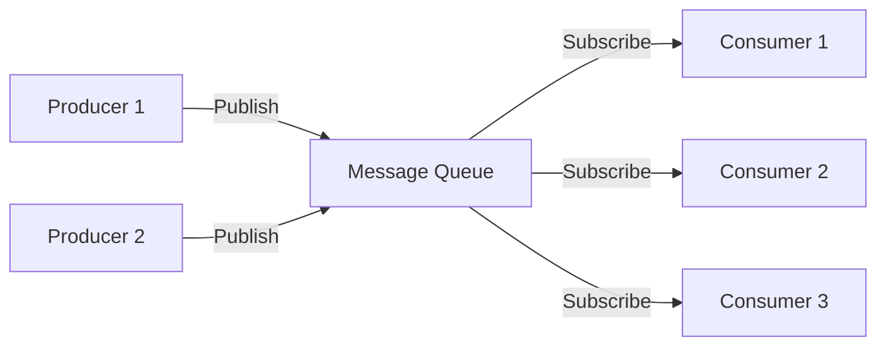

Message queues enable asynchronous communication between distributed components, improving system performance through decoupling, traffic smoothing, and fault tolerance.

## Message Queue Fundamentals

### What is a Message Queue?

A message queue is an **inter-application communication mechanism** where:
- **Producers** send messages without waiting for processing
- **Message broker** ensures reliable delivery
- **Consumers** retrieve and process messages independently



<Info>
  **Design Pattern Connection**: Message queues implement the Observer pattern - publishers emit events without knowing who will consume them, and subscribers receive events without knowing who published them.
</Info>

### Core Components

<CardGroup cols={3}>
  <Card title="Producer" icon="paper-plane">
    Sends messages to the queue
    - Publishes without waiting
    - No knowledge of consumers
    - Can continue processing immediately
  </Card>
  
  <Card title="Message Broker" icon="server">
    Central message processing system
    - Stores messages reliably
    - Routes to consumers
    - Ensures delivery guarantees
  </Card>
  
  <Card title="Consumer" icon="inbox">
    Retrieves and processes messages
    - Pulls from queue
    - No knowledge of producers
    - Processes asynchronously
  </Card>
</CardGroup>

### Why Use Message Queues?

<Tabs>
  <Tab title="Asynchronous Processing">
    **Improve system performance by deferring non-critical operations**
    
    <Steps>
      <Step title="Synchronous problem">
        ```mermaid
        sequenceDiagram
            User->>OrderSystem: Place Order
            OrderSystem->>Inventory: Check Stock
            OrderSystem->>Payment: Process Payment
            OrderSystem->>SMS: Send Confirmation
            OrderSystem->>Email: Send Receipt
            OrderSystem->>Logger: Record Event
            OrderSystem->>User: Order Complete (SLOW!)
        ```
        
        **Issues**: Long response time, user waits for all operations
      </Step>
      
      <Step title="Asynchronous solution">
        ```mermaid
        sequenceDiagram
            User->>OrderSystem: Place Order
            OrderSystem->>Inventory: Check Stock
            OrderSystem->>Payment: Process Payment
            OrderSystem->>Queue: Publish Events
            OrderSystem->>User: Order Accepted (FAST!)
            Queue-->>SMS: Async Send
            Queue-->>Email: Async Send
            Queue-->>Logger: Async Record
        ```
        
        **Benefits**: Fast response, background processing
      </Step>
    </Steps>
    
    <Card title="Real Example: E-commerce Order" icon="cart-shopping">
      **Critical path** (synchronous):
      - Validate inventory
      - Process payment
      - Create order record
      
      **Background tasks** (async via queue):
      - Send SMS notifications
      - Send email receipts
      - Update analytics
      - Log audit trail
    </Card>
  </Tab>
  
  <Tab title="Decoupling">
    **Reduce dependencies between system components**
    
    **Before (tightly coupled)**:
    ```java
    public void placeOrder(Order order) {
        inventoryService.reserve(order);  // Direct dependency
        paymentService.charge(order);      // Direct dependency
        smsService.notify(order);          // Direct dependency
        emailService.send(order);          // Direct dependency
        logService.record(order);          // Direct dependency
    }
    ```
    
    **Problems**:
    - All services must be available
    - Changes cascade across services
    - Difficult to add new integrations
    
    **After (loosely coupled)**:
    ```java
    public void placeOrder(Order order) {
        inventoryService.reserve(order);
        paymentService.charge(order);
        
        // Publish event, don't call directly
        eventPublisher.publish("order.created", order);
        
        return order; // Fast response
    }
    ```
    
    **Benefits**:
    - Services work independently
    - Easy to add new consumers
    - Failures isolated
  </Tab>
  
  <Tab title="Traffic Smoothing">
    **Handle traffic spikes without overloading backend**
    
    ```mermaid
    graph TB
        subgraph "Without Queue"
            S1[Traffic Spike] -->|Overwhelms| B1[Backend]
            B1 -->|Crashes| F1[Failure]
        end
        
        subgraph "With Queue"
            S2[Traffic Spike] -->|Buffered| Q[Queue]
            Q -->|Steady Rate| B2[Backend]
            B2 -->|Stable| OK[Success]
        end
    ```
    
    <Card title="Peak Shaving Example" icon="chart-line">
      **Scenario**: Flash sale with 10,000 requests/second
      
      **Without queue**:
      - Backend can handle 1,000 req/s
      - System crashes or rejects 9,000 req/s
      
      **With queue**:
      - Queue accepts all 10,000 req/s
      - Backend processes at sustainable 1,000 req/s
      - All requests eventually processed
      - Graceful degradation under load
    </Card>
  </Tab>
</Tabs>

## Reliability Guarantees

<CardGroup cols={3}>
  <Card title="Durability" icon="hard-drive">
    Messages must not be lost
    - Persist to disk
    - Replicate across nodes
    - Survive broker restarts
  </Card>
  
  <Card title="At-Least-Once Delivery" icon="check-double">
    Every message consumed at least once
    - Consumer acknowledgment (ACK)
    - Retry on failure
    - Idempotent processing
  </Card>
  
  <Card title="Ordering" icon="list-ol">
    Preserve message order when required
    - Per-partition ordering
    - Single consumer per partition
    - Trade-off with parallelism
  </Card>
</CardGroup>

## Redis as Message Queue

Redis is primarily a cache, but its data structures can implement simple message queues. Three approaches:

<Tabs>
  <Tab title="List (PUSH/POP)">
    ### Production-Consumption with Redis Lists
    
    **Pattern**: Producer-Consumer (Point-to-Point)
    
    Redis Lists are doubly-linked lists with O(1) insert/delete at both ends - perfect for FIFO queues.
    
    #### Approach 1: LPUSH + RPOP
    
    ```bash
    # Producer adds to left (head)
    LPUSH queue:orders '{"orderId": 123, "amount": 99.99}'
    
    # Consumer removes from right (tail) - FIFO
    RPOP queue:orders
    ```
    
    ✅ **Advantages**:
    - O(1) time complexity
    - FIFO ordering guaranteed
    - Redis persistence protects server-side data
    
    ❌ **Critical Issues**:
    
    <Warning>
      **1. Performance Risk - Busy Polling**
      
      ```php
      // BAD: CPU-intensive busy loop
      while(true) {
          $result = $redis->rpop("queue");
          if($result) {
              $data = json_decode($result, true);
              // process...
          }
          // Empty queue = wasted CPU cycles!
      }
      ```
      
      - Consumers constantly poll even when queue empty
      - Wastes CPU resources
      - Increases Redis load
    </Warning>
    
    <Warning>
      **2. Point-to-Point Only**
      
      - Single consumer gets each message
      - No broadcast/fanout capability
      - First consumer wins (based on speed)
    </Warning>
    
    <Warning>
      **3. Data Safety - Client-Side Risk**
      
      ```
      RPOP removes from server immediately
      ↓
      Data now only in client memory
      ↓
      If client crashes → Message lost forever!
      ```
      
      - No acknowledgment mechanism
      - Cannot retry failed processing
      - Network issues = data loss
    </Warning>
    
    #### Approach 2: LPUSH + BRPOP (Recommended)
    
    **Blocking pop** solves the busy-polling problem:
    
    ```bash
    # Consumer blocks until data available or timeout
    BRPOP queue:orders 30  # Wait up to 30 seconds
    # Returns: 1) "queue:orders" 2) "{message}"
    
    # Wait indefinitely (timeout=0)
    BRPOP queue:orders 0
    ```
    
    ✅ **Benefits**:
    - **No busy-waiting**: Client sleeps until message arrives
    - **Reduced Redis load**: No constant polling
    - **Instant processing**: Wakes immediately when message published
    - **Multiple queues**: `BRPOP queue1 queue2 queue3 0` (priority order)
    
    <Info>
      **How BRPOP works:**
      
      1. If queue has data → Returns immediately
      2. If queue empty → Client connection blocks
      3. When new data arrives → Client instantly awakened
      4. If timeout reached → Returns nil
    </Info>
    
    <Warning>
      **Exception Handling Required**
      
      ```python
      while True:
          try:
              result = redis.brpop('queue:orders', timeout=30)
              if result:
                  process_message(result[1])
          except redis.exceptions.ConnectionError:
              # Server disconnected idle connection
              reconnect()
      ```
      
      Redis may close idle connections to save resources. Always handle connection errors!
    </Warning>
    
    ❌ **Still has issues**:
    - Client data safety problem remains
    - No ACK mechanism
    - Cannot handle failed processing
    
    #### Approach 3: LPUSH + LRANGE + RPOP
    
    **Strategy**: Read first, then consume after processing
    
    ```bash
    # Consumer peeks at message (doesn't remove)
    LRANGE queue:orders -1 -1  # Get last element
    
    # Process message...
    # If successful:
    RPOP queue:orders  # Now remove it
    ```
    
    ✅ **Improves safety**:
    - Message stays on server during processing
    - Client crash doesn't lose message
    
    ❌ **New problems**:
    - Not blocking (back to busy-polling)
    - **Duplicate processing risk**: If consumer crashes after processing but before RPOP
    
    #### Approach 4: LPUSH + BRPOPLPUSH + LREM (Most Reliable)
    
    **Atomic move** to backup queue:
    
    ```bash
    # Atomically move from main queue to processing queue
    BRPOPLPUSH queue:orders queue:processing 30
    
    # Consumer processes message...
    # On success, remove from processing queue:
    LREM queue:processing 1 "{message}"
    ```
    
    <Card title="How It Works" icon="gears">
      ```mermaid
      sequenceDiagram
          participant P as Producer
          participant Q as Main Queue
          participant B as Processing Queue
          participant C as Consumer
          
          P->>Q: LPUSH message
          C->>Q: BRPOPLPUSH (atomic)
          Q->>B: Move message
          Q->>C: Return message
          Note over C: Process message
          C->>B: LREM (remove on success)
      ```
    </Card>
    
    ✅ **Advantages**:
    - **Atomic operation**: Message never lost between queues
    - **Server-side safety**: All operations on Redis
    - **Crash recovery**: Unacknowledged messages stay in processing queue
    - **Blocking**: No busy-polling
    
    ❌ **Remaining issue**:
    
    <Warning>
      **Stuck messages**: If consumer crashes, messages stuck in `queue:processing`
      
      **Solution**: Monitoring daemon
      ```python
      # Separate process monitors processing queue
      def rescue_stuck_messages():
          while True:
              # Find messages older than timeout
              old_messages = find_old_messages('queue:processing', timeout=300)
              for msg in old_messages:
                  # Move back to main queue
                  redis.rpoplpush('queue:processing', 'queue:orders')
              time.sleep(60)
      ```
      
      This creates a **circular queue** for automatic retry.
    </Warning>
    
    #### Summary: List-Based Patterns
    
    | Approach | Blocking | Data Safety | Duplicate Risk | Complexity |
    |----------|----------|-------------|----------------|------------|
    | LPUSH + RPOP | ❌ | ❌ Server only | ❌ | Low |
    | LPUSH + BRPOP | ✅ | ❌ Server only | ❌ | Low |
    | LPUSH + LRANGE + RPOP | ❌ | ⚠️ Better | ✅ Possible | Medium |
    | LPUSH + BRPOPLPUSH | ✅ | ✅ Best | ✅ Possible* | High |
    
    *Requires monitoring daemon for stuck message recovery
  </Tab>
  
  <Tab title="Pub/Sub">
    ### Publish-Subscribe Pattern
    
    **Pattern**: Message Broadcasting (One-to-Many)
    
    Unlike List queues (one consumer per message), Pub/Sub sends each message to **all subscribers**.
    
    ```mermaid
    graph TB
        P[Publisher] -->|PUBLISH| C[Channel: order.created]
        C -->|Broadcast| S1[Subscriber 1]
        C -->|Broadcast| S2[Subscriber 2]
        C -->|Broadcast| S3[Subscriber 3]
    ```
    
    #### Basic Commands
    
    ```bash
    # Subscribers listen to channel
    SUBSCRIBE channel:orders
    # Output:
    # 1) "subscribe"
    # 2) "channel:orders"
    # 3) (integer) 1  # Number of subscriptions
    
    # Publisher sends message
    PUBLISH channel:orders '{"orderId": 123}'
    # Returns: (integer) 3  # Number of subscribers who received it
    
    # All subscribers receive:
    # 1) "message"           # Type
    # 2) "channel:orders"    # Channel name
    # 3) '{"orderId": 123}'  # Message payload
    
    # Unsubscribe
    UNSUBSCRIBE channel:orders
    ```
    
    #### Pattern Matching with PSUBSCRIBE
    
    Subscribe to multiple channels with wildcards:
    
    ```bash
    # Subscribe to all payment-related channels
    PSUBSCRIBE pay.*
    
    # Receives messages from:
    # - pay.success
    # - pay.failed
    # - pay.refund
    # - pay.anything
    ```
    
    **Message format (4 fields)**:
    ```bash
    1) "pmessage"           # Type (pattern message)
    2) "pay.*"              # Pattern matched
    3) "pay.success"        # Actual channel
    4) '{"amount": 99.99}'  # Payload
    ```
    
    #### Use Cases
    
    <CardGroup cols={2}>
      <Card title="Event Broadcasting" icon="broadcast-tower">
        **Example**: Order created event
        
        ```python
        # Publisher
        redis.publish('order.created', json.dumps({
            'orderId': 123,
            'userId': 456
        }))
        
        # Multiple consumers:
        # - Inventory service (reduce stock)
        # - Email service (send confirmation)
        # - Analytics service (track metrics)
        # - Notification service (push alert)
        ```
      </Card>
      
      <Card title="Real-Time Messaging" icon="comments">
        **Example**: Chat application
        
        ```python
        # User joins chat room
        redis.subscribe(f'chat:room:{room_id}')
        
        # User sends message
        redis.publish(f'chat:room:{room_id}', message)
        
        # All room participants receive instantly
        ```
      </Card>
    </CardGroup>
    
    #### Critical Limitations
    
    <Warning>
      **🚨 Fire-and-Forget Model**
      
      Pub/Sub has **NO persistence or reliability**:
      
      1. **No message storage**
         - Messages exist only in transit
         - If no subscribers → Message dropped
         - Cannot retrieve historical messages
      
      2. **No delivery guarantees**
         - Network disconnect → Messages lost
         - Redis restart → All in-flight messages lost
         - No acknowledgment mechanism
      
      3. **No retry capability**
         - Failed processing → Message gone forever
         - Cannot replay messages
         - No dead-letter queue
    </Warning>
    
    <Card title="When NOT to use Pub/Sub" icon="triangle-exclamation">
      **Avoid for critical operations:**
      
      ❌ Payment confirmations
      ❌ Order processing
      ❌ Financial transactions
      ❌ Anything requiring guaranteed delivery
      
      **Use professional MQ instead**: RabbitMQ, Kafka, RocketMQ
    </Card>
    
    #### Internal Implementation
    
    <Accordion title="How Redis Pub/Sub Works Internally">
      Redis maintains a dictionary (hash map) for Pub/Sub:
      
      ```python
      # Simplified internal structure
      pubsub_channels = {
          'channel:orders': [client1, client2, client3],  # Linked list of subscribers
          'channel:payments': [client2, client4],
          'news.tech': [client1, client5, client6]
      }
      ```
      
      **SUBSCRIBE flow**:
      1. Client subscribes to channel
      2. Redis adds client to channel's subscriber list
      
      **PUBLISH flow**:
      1. Look up channel in dictionary
      2. Iterate through subscriber list
      3. Send message to each subscriber
      4. Return count of recipients
      
      **Why it's fast**: O(1) lookup, O(N) broadcast where N = subscribers
    </Accordion>
    
    #### Best Practices
    
    ✅ **Good use cases**:
    - Real-time dashboards
    - Live notifications (can tolerate loss)
    - Cache invalidation signals
    - Presence detection (user online/offline)
    
    ⚠️ **Acceptable with care**:
    - Chat applications (users understand potential message loss)
    - Live sports scores
    - Stock price updates
    
    ❌ **Never use for**:
    - Business-critical events
    - Financial transactions
    - Audit logs
    - Anything requiring compliance
  </Tab>
  
  <Tab title="Streams (Redis 5.0+)">
    ### Redis Streams - Production-Grade MQ
    
    **Introduced**: Redis 5.0 (2018)
    
    **Inspiration**: Apache Kafka concepts
    
    Streams combine the best of Lists and Pub/Sub while adding **persistence**, **consumer groups**, and **acknowledgments**.
    
    #### Key Features
    
    <CardGroup cols={2}>
      <Card title="Persistent Log" icon="database">
        - Append-only message log
        - Messages stored on disk
        - Survives Redis restart
        - Each message has unique ID
      </Card>
      
      <Card title="Consumer Groups" icon="users">
        - Multiple consumers per group
        - Load balancing within group
        - Independent group progress
        - Exactly-once semantics
      </Card>
      
      <Card title="Acknowledgments" icon="check">
        - Track pending messages (PEL)
        - Retry unacknowledged messages
        - Prevent message loss
        - Handle consumer failures
      </Card>
      
      <Card title="Random Access" icon="magnifying-glass">
        - Read from any position
        - Time-based queries
        - Message replay capability
        - Historical data access
      </Card>
    </CardGroup>
    
    #### Basic Operations
    
    ```bash
    # Producer: Add message to stream
    XADD mystream * orderId 123 amount 99.99
    # Returns: "1638360000000-0" (timestamp-sequence ID)
    
    # Consumer: Read new messages
    XREAD COUNT 1 STREAMS mystream $
    # $ means "only new messages from now on"
    ```
    
    #### Independent Consumption
    
    Each consumer independently reads the stream:
    
    ```bash
    # Consumer 1 reads from beginning
    XREAD COUNT 10 STREAMS mystream 0
    
    # Consumer 2 reads only new messages
    XREAD COUNT 10 STREAMS mystream $
    
    # Blocking read (like BRPOP)
    XREAD BLOCK 5000 COUNT 1 STREAMS mystream $
    # Blocks up to 5 seconds waiting for new messages
    ```
    
    <Info>
      **Special ID `$`**: Represents the maximum ID currently in the stream. Use it to read only messages that arrive **after** you start listening.
    </Info>
    
    #### Consumer Groups - The Power Feature
    
    Consumer groups enable **distributed processing** like Kafka:
    
    ```mermaid
    graph TB
        P[Producer] -->|XADD| S[Stream: orders]
        
        S --> G1[Consumer Group: email-service]
        S --> G2[Consumer Group: analytics-service]
        
        G1 --> C1[Consumer 1]
        G1 --> C2[Consumer 2]
        G1 --> C3[Consumer 3]
        
        G2 --> C4[Consumer A]
        G2 --> C5[Consumer B]
    ```
    
    **Key concepts**:
    
    <Accordion title="Consumer Group Components">
      1. **Consumer Group**: Named group of consumers
         - Has independent position (`last_delivered_id`)
         - Tracks which messages delivered to whom
         - Multiple groups can read same stream
      
      2. **PEL (Pending Entries List)**:
         - Per-consumer list of unacknowledged messages
         - Grows when messages read
         - Shrinks when messages acknowledged
         - Enables failure recovery
      
      3. **Consumer**: Individual processor within group
         - Gets different messages (load balanced)
         - Must acknowledge after processing
         - Can claim abandoned messages from failed consumers
    </Accordion>
    
    #### Consumer Group Commands
    
    ```bash
    # 1. Create consumer group
    XGROUP CREATE mystream email-group 0
    #                                   ^
    #                                   Start from beginning (0)
    #                                   Use $ for "only new messages"
    
    # 2. Read as part of group
    XREADGROUP GROUP email-group consumer1 COUNT 1 STREAMS mystream >
    #                                                                ^
    #                                                                Read undelivered messages
    
    # Returns:
    # 1) 1) "mystream"
    #    2) 1) 1) "1638360000000-0"
    #          2) 1) "orderId"
    #             2) "123"
    #             3) "amount"
    #             4) "99.99"
    
    # 3. Acknowledge successful processing
    XACK mystream email-group 1638360000000-0
    # Returns: (integer) 1
    ```
    
    #### Comparison: Independent vs. Group Consumption
    
    <Tabs>
      <Tab title="Independent (Fan-Out)">
        **Pattern**: Every consumer gets every message
        
        ```python
        # Each consumer reads independently
        messages = redis.xread(
            count=10,
            streams={'mystream': last_id}
        )
        ```
        
        **Use case**: Broadcasting events to multiple services
        
        ✅ Each service processes all events
        ❌ No load distribution
      </Tab>
      
      <Tab title="Consumer Group (Load Balanced)">
        **Pattern**: Messages distributed among group members
        
        ```python
        # Multiple workers share the load
        messages = redis.xreadgroup(
            groupname='worker-group',
            consumername='worker-1',
            count=10,
            streams={'mystream': '>'}
        )
        ```
        
        **Use case**: Parallel processing of tasks
        
        ✅ Horizontal scaling
        ✅ Load distribution
        ✅ Fault tolerance
      </Tab>
    </Tabs>
    
    #### Handling Failures
    
    <Steps>
      <Step title="Consumer crashes">
        Messages remain in PEL (unacknowledged)
      </Step>
      
      <Step title="Monitor pending messages">
        ```bash
        # View pending messages for a consumer
        XPENDING mystream worker-group - + 10 consumer1
        ```
      </Step>
      
      <Step title="Claim abandoned messages">
        ```bash
        # Another consumer takes over
        XCLAIM mystream worker-group consumer2 3600000 1638360000000-0
        #                                       ^
        #                                       Min idle time (1 hour)
        ```
      </Step>
      
      <Step title="Process and acknowledge">
        ```bash
        # After successful processing
        XACK mystream worker-group 1638360000000-0
        ```
      </Step>
    </Steps>
    
    #### Stream Management
    
    ```bash
    # Limit stream size (automatic trimming)
    XADD mystream MAXLEN ~ 10000 * field value
    #                     ^
    #                     ~ means approximate (more efficient)
    
    # Delete specific messages
    XDEL mystream 1638360000000-0
    
    # Get stream info
    XINFO STREAM mystream
    
    # Get consumer group info
    XINFO GROUPS mystream
    
    # Get consumers in group
    XINFO CONSUMERS mystream worker-group
    ```
    
    #### No Built-In Partitioning
    
    <Warning>
      **Difference from Kafka**: Redis Streams don't have built-in partitioning.
      
      To achieve Kafka-like partitioning:
      ```python
      # Client-side routing based on key
      def get_stream_name(order_id):
          partition = hash(order_id) % NUM_PARTITIONS
          return f"orders:partition:{partition}"
      
      # Send to appropriate partition
      stream = get_stream_name(order['id'])
      redis.xadd(stream, order)
      ```
    </Warning>
    
    #### Production Considerations
    
    <CardGroup cols={2}>
      <Card title="Memory Management" icon="memory">
        Streams grow indefinitely - use trimming:
        
        ```bash
        # Keep only recent messages
        XTRIM mystream MAXLEN ~ 100000
        
        # Or use TTL strategy
        XADD mystream MAXLEN ~ 10000 * data value
        ```
      </Card>
      
      <Card title="Monitoring" icon="chart-line">
        Track key metrics:
        - Stream length (XLEN)
        - Consumer lag (XPENDING)
        - Processing rate
        - Memory usage
      </Card>
    </CardGroup>
    
    #### When to Use Streams
    
    ✅ **Perfect for**:
    - Event sourcing
    - Activity feeds
    - Sensor data collection
    - Real-time analytics pipelines
    - Task queues with persistence
    
    ⚠️ **Consider alternatives for**:
    - Multi-datacenter replication (use Kafka)
    - Massive throughput >1M msg/s (use Kafka/Pulsar)
    - Complex routing rules (use RabbitMQ)
    - Guaranteed cross-region delivery (use cloud-native MQ)
  </Tab>
</Tabs>

## Redis MQ Pattern Comparison

| Feature | List (BRPOP) | List (BRPOPLPUSH) | Pub/Sub | Streams |
|---------|--------------|-------------------|---------|----------|
| **Persistence** | ✅ Yes | ✅ Yes | ❌ No | ✅ Yes |
| **At-Least-Once** | ❌ No | ⚠️ With monitoring | ❌ No | ✅ Yes (ACK) |
| **Multiple Consumers** | ❌ Competing | ❌ Competing | ✅ Broadcast | ✅ Both modes |
| **Consumer Groups** | ❌ No | ❌ No | ❌ No | ✅ Yes |
| **Message Replay** | ❌ No | ❌ No | ❌ No | ✅ Yes |
| **Blocking Read** | ✅ Yes | ✅ Yes | ✅ Yes | ✅ Yes |
| **Complexity** | Low | Medium | Low | High |
| **Best For** | Simple queues | Reliable queues | Events | Production MQ |

## Design Considerations

<CardGroup cols={2}>
  <Card title="Idempotency" icon="fingerprint">
    **Handle duplicate messages gracefully**
    
    ```python
    # Use unique message ID
    processed_ids = set()
    
    def process_message(msg_id, data):
        if msg_id in processed_ids:
            return  # Already processed
        
        # Do work...
        processed_ids.add(msg_id)
    ```
    
    Store processed IDs in Redis with expiration
  </Card>
  
  <Card title="Message TTL" icon="clock">
    **Prevent queue bloat**
    
    ```python
    # Add timestamp to messages
    message = {
        'data': payload,
        'timestamp': time.time()
    }
    
    # Consumer checks age
    age = time.time() - msg['timestamp']
    if age > MAX_AGE:
        # Discard or move to DLQ
        pass
    ```
  </Card>
  
  <Card title="Error Handling" icon="triangle-exclamation">
    **Implement dead-letter queue**
    
    ```python
    MAX_RETRIES = 3
    
    try:
        process(message)
    except Exception as e:
        retries = get_retry_count(msg_id)
        if retries < MAX_RETRIES:
            requeue(message)
        else:
            move_to_dlq(message, error=str(e))
    ```
  </Card>
  
  <Card title="Monitoring" icon="gauge">
    **Track queue health**
    
    Key metrics:
    - Queue depth (backlog)
    - Processing rate
    - Error rate
    - Consumer lag
    - Message age
  </Card>
</CardGroup>

## Production Message Queue Alternatives

<Warning>
  **When Redis isn't enough:**
  
  For mission-critical message processing with strict reliability requirements, use dedicated message queue systems:
</Warning>

<CardGroup cols={3}>
  <Card title="RabbitMQ" icon="rabbit">
    **Best for**: Complex routing, traditional MQ patterns
    
    ✅ Rich routing (exchanges, bindings)
    ✅ Strong delivery guarantees
    ✅ Management UI
    ✅ Multi-protocol (AMQP, MQTT, STOMP)
    
    ❌ Lower throughput than Kafka
    ❌ More operational complexity
  </Card>
  
  <Card title="Apache Kafka" icon="stream">
    **Best for**: High-throughput event streaming
    
    ✅ Massive scalability (millions msg/s)
    ✅ Long-term storage
    ✅ Stream processing (Kafka Streams)
    ✅ Distributed partitioning
    
    ❌ Complex setup
    ❌ Requires ZooKeeper (pre-3.x)
  </Card>
  
  <Card title="RocketMQ" icon="rocket">
    **Best for**: E-commerce, financial systems
    
    ✅ Designed for transactional messages
    ✅ Scheduled/delayed messages
    ✅ Alibaba battle-tested
    ✅ Lower latency than Kafka
    
    ❌ Smaller ecosystem
    ❌ Less documentation (English)
  </Card>
</CardGroup>

### Decision Matrix

<Tabs>
  <Tab title="Use Redis When...">
    ✅ **Good fit for Redis MQ:**
    - Already using Redis for caching
    - Simple queue requirements
    - Low-to-medium message volume (less than 10K msg/s)
    - Message loss tolerance (Pub/Sub) or using Streams
    - Need minimal infrastructure
    - Development/testing environments
    
    **Example use cases**:
    - Email/SMS notification queues
    - Background job processing
    - Cache invalidation
    - Real-time activity feeds
  </Tab>
  
  <Tab title="Use Professional MQ When...">
    ❌ **Redis not suitable when:**
    - Financial transactions (payments, orders)
    - Regulatory compliance required
    - Multi-datacenter replication needed
    - Complex routing rules
    - Very high throughput (>100K msg/s)
    - Long message retention (days/weeks)
    - Message priority queues
    - Guaranteed exactly-once delivery
    
    **Example use cases**:
    - Payment processing
    - Order fulfillment systems
    - Audit logging
    - IoT data ingestion at scale
    - Event sourcing for financial systems
  </Tab>
</Tabs>

## Best Practices Summary

<Steps>
  <Step title="Choose the right pattern">
    - Simple tasks → List with BRPOP
    - Reliable delivery → List with BRPOPLPUSH or Streams
    - Broadcasting → Pub/Sub (if loss acceptable) or Streams
    - Production critical → Redis Streams or dedicated MQ
  </Step>
  
  <Step title="Design for failure">
    - Implement idempotent processing
    - Use acknowledgments (Streams)
    - Set up dead-letter queues
    - Monitor and alert on queue depth
  </Step>
  
  <Step title="Manage resources">
    - Trim streams/lists to prevent memory bloat
    - Set message TTLs
    - Monitor Redis memory usage
    - Plan for scaling (add consumers, partition streams)
  </Step>
  
  <Step title="Test failure scenarios">
    - Consumer crashes mid-processing
    - Network partitions
    - Redis restarts
    - Message replay after failures
  </Step>
</Steps>

## Related Topics

<CardGroup cols={2}>
  <Card title="Load Balancing" href="/topics/system-design/load-balancing" icon="scale-balanced">
    Distribute synchronous traffic across servers
  </Card>
  
  <Card title="Service Discovery" href="/topics/distributed-systems/service-discovery" icon="compass">
    Dynamic service location for distributed messaging
  </Card>
</CardGroup>
